# ELSPETH Architecture

C4 model documentation for the ELSPETH auditable pipeline framework.

**Last Updated:** 2026-07-23 (synchronized with 0.7.1 release line)
**Framework Version:** 0.7.1 (package metadata aligned at 0.7.1)
**Status:** Pre-release

---

## At a Glance

| Question | Answer |
|----------|--------|
| **What is ELSPETH?** | Auditable Sense/Decide/Act pipeline framework with YAML, CLI/TUI, and Web Composer authoring surfaces |
| **Core subsystems?** | 11 major subsystems (20+ including sub-components) across 5 architectural tiers |
| **Data flow?** | Source → Transforms/Gates → Sinks (all recorded) |
| **Audit storage?** | SQLite/SQLCipher (dev) / PostgreSQL (prod) |
| **Extension model?** | pluggy-based plugin system |
| **Production LOC** | ~310,600 Python lines across 667 files in `src/elspeth/` (frontend TSX/CSS counts not included) |
| **Test LOC** | ~727,300 Python lines across 1,565 files (2.3:1 ratio) |

---

## How to Read This Document

| Audience | Start Here |
|----------|------------|
| **New developers** | [System Context](#level-1-system-context-diagram) → [Container Diagram](#level-2-container-diagram) → [Quality Assessment](#quality-assessment) |
| **Plugin authors** | [Plugins Components](#33-plugins-components) → [Schema Contract Validation](#schema-contract-validation-flow) |
| **Engine contributors** | [Engine Components](#31-engine-components) → [Pipeline Execution Flow](#pipeline-execution-flow) → [Fork/Join Processing](#forkjoin-processing-flow) |
| **Operators** | [Deployment View](#deployment-view) → [Telemetry Flow](#telemetry-flow-diagram) |
| **Architects** | [Dependency Graph](#dependency-graph) → [ADRs](#architecture-decision-records-adrs) → [Quality Assessment](#quality-assessment) |
| **Auditors** | [Trust Boundary](#trust-boundary-diagram) → [Landscape Components](#32-landscape-components) |

---

## Table of Contents

- [Level 1: System Context](#level-1-system-context-diagram)
- [Level 2: Container Diagram](#level-2-container-diagram)
- [Level 3: Component Diagrams](#level-3-component-diagrams)
  - [Engine Components](#31-engine-components)
  - [Landscape Components](#32-landscape-components)
  - [Plugins Components](#33-plugins-components)
- [Data Flow Diagrams](#data-flow-diagrams)
  - [Pipeline Execution Flow](#pipeline-execution-flow)
  - [Token Lifecycle](#token-lifecycle)
  - [Fork/Join Processing Flow](#forkjoin-processing-flow)
- [Deployment View](#deployment-view)
- [Telemetry Flow Diagram](#telemetry-flow-diagram)
- [Dependency Graph](#dependency-graph)
- [Schema Contract Validation Flow](#schema-contract-validation-flow)
- [Trust Boundary Diagram](#trust-boundary-diagram)
- [Architecture Decision Records](#architecture-decision-records-adrs)
- [Quality Assessment](#quality-assessment)
- [Summary](#summary)

---

## Level 1: System Context Diagram

Shows ELSPETH's relationship with external actors and systems.

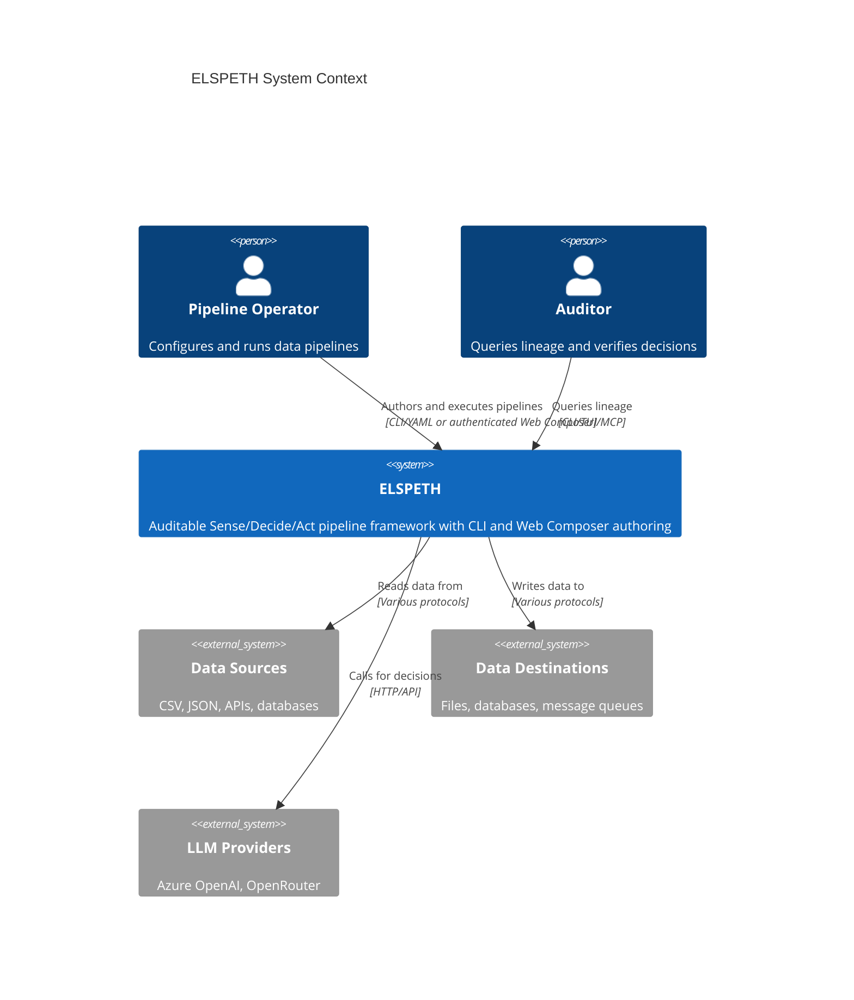

**Key relationships:**

| Actor/System | Interaction |
|--------------|-------------|
| Pipeline Operator | Authors YAML or uses Web Composer, executes pipelines, and monitors runs |
| Auditor | Queries lineage through CLI, TUI, or MCP and verifies decisions |
| Data Sources | CSV, JSON, APIs - read by Source plugins |
| Data Destinations | Files, databases - written by Sink plugins |
| LLM Providers | External calls for classification via LLM pack |

---

## Level 2: Container Diagram

Shows the major subsystems within ELSPETH.

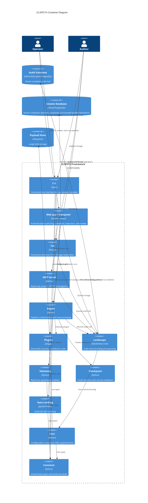

### Container Responsibilities

| Container | Technology | LOC | Purpose |
|-----------|------------|-----|---------|
| **CLI** | Typer | ~2,200 | User commands: `run`, `explain`, `validate`, `resume` |
| **Web app + Composer** | FastAPI + React | ~133,700 Python | Authenticated sessions, guided/freeform authoring, validation, execution, and review |
| **TUI** | Textual | ~800 | Interactive lineage exploration |
| **MCP Server** | Python | ~3,600 | Read-only analysis API with domain-specific analyzers |
| **Engine** | Python | ~32,300 | Run lifecycle, durable scheduling, DAG execution, and effect coordination |
| **Plugins** | pluggy | ~47,700 | Extensible sources, transforms, effect-safe sinks, LLM providers, and clients |
| **Landscape** | SQLAlchemy Core | ~32,100 | Audit repositories, durable work/effect ledgers, querying, export, and SQLCipher support |
| **Testing** (`src/elspeth/testing/`) | Python | ~900 | `elspeth-xdist-auto` pytest plugin shipped inside the `elspeth` package — distinct from the project's own `tests/` test suite, which is not part of the shipped package and is where the ChaosLLM / ChaosWeb / ChaosEngine test fixtures live |
| **Telemetry** | Python | ~1,200 | Real-time event export (OTLP, Datadog, Azure Monitor) |
| **Checkpoint** | Python | ~600 | Crash recovery with topology validation |
| **Rate Limiting** | pyrate-limiter | ~300 | External call throttling with persistence |
| **Core** | Python | ~5,000 | Config, canonical JSON, DAG package, payload store |
| **Contracts** | Python | ~28,300 | Shared dataclasses, enums, protocols (leaf module) |
| **Audit DB** | SQLite/SQLCipher/PostgreSQL | — | Complete audit trail and effect storage (41 tables; SQLite schema epoch 29) |
| **Payload Store** | Filesystem | — | Content-addressable blob storage with retention |

**Inventory measured from committed `HEAD` on 2026-07-23:** ~310,600 production
Python lines across 667 files in `src/elspeth/`; ~727,300 test Python lines across 1,565 files
(2.3:1). Frontend TypeScript and CSS are not included.

---

## Level 3: Component Diagrams

### 3.1 Engine Components

The Engine orchestrates pipeline execution and row processing.

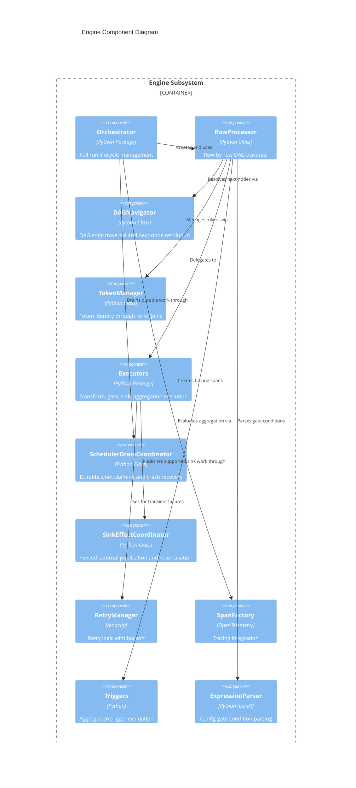

| Component | File | LOC | Responsibility |
|-----------|------|-----|----------------|
| **Orchestrator** | `orchestrator/` | ~3,500 | Begin run → register nodes/edges → process rows → complete run |
| **RowProcessor** | `processor.py` | ~1,860 | Work queue-based DAG traversal, fork/join handling |
| **DAGNavigator** | `dag_navigator.py` | ~250 | DAG edge traversal and next-node resolution |
| **TokenManager** | `tokens.py` | ~393 | Create, fork, coalesce, expand tokens |
| **Executors** | `executors/` | ~2,190 | Transform, gate, sink, aggregation execution (5 modules) |
| **SchedulerDrainCoordinator** | `scheduler_drain.py` | — | Claims durable work, repairs expired leases, and converges terminal handoff. |
| **SinkEffectCoordinator** | `executors/sink_effects.py` | — | Reserves, prepares, fences, reconciles, and finalizes external publication. |
| **CoalesceExecutor** | `coalesce_executor.py` | ~1,054 | Fork/join merge barrier with policy-driven merging |
| **RetryManager** | `retry.py` | ~146 | Tenacity-based retry with exponential backoff |
| **SpanFactory** | `spans.py` | ~298 | Create OpenTelemetry spans for observability |
| **Triggers** | `triggers.py` | ~301 | Evaluate count/timeout/condition triggers for aggregation |
| **ExpressionParser** | `core/expression_parser.py` | ~652 | Safe AST-based expression evaluation (no eval) — lives in `core/` (used by config validation) |
| **BatchAdapter** | `batch_adapter.py` | ~226 | Batch transform output routing |
| **Clock** | `clock.py` | ~11 | Testable time abstraction |

### 3.2 Landscape Components

Landscape records audit evidence and owns the durable ledgers used to recover
scheduler, barrier, sink, and export work.

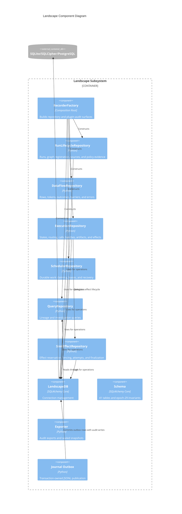

| Component | File | Responsibility |
|-----------|------|----------------|
| **RecorderFactory** | `factory.py` | Composition root for repositories and plugin audit adapters. |
| **RunLifecycleRepository** | `run_lifecycle_repository.py` | Run lifecycle, graph registration, per-source state, attribution, and web plugin-policy evidence. |
| **DataFlowRepository** | `data_flow_repository.py` | Rows, tokens, ancestry, outcomes, validation errors, and durable coalesce effects. |
| **ExecutionRepository** | `execution_repository.py` | Node states, routing, calls, operations, batches, artifacts, exports, and sink effects. |
| **SchedulerRepository** | `scheduler_repository.py` | Durable work items, compare-and-swap leases, recovery, and run coordination. |
| **QueryRepository** | `query_repository.py` | Operator lineage and investigation queries. |
| **LandscapeDB** | `database.py` | Connection handling, schema validation, SQLite/SQLCipher/PostgreSQL support. |
| **Schema** | `schema.py` | Authoritative 41-table, epoch-29 schema and constraints. |
| **Exporter** | `exporter.py` | Complete audit export, including effect streams and attempts. |
| **Journal** | `journal.py` | Transaction-owned sidecar-journal outbox and recovery drain. |

### Audit Trail Tables (41 Total)

```
runs (run lifecycle) → run_attributions / preflight_results / run_sources / run_web_plugin_policy
  ↓
nodes (DAG nodes) → edges (DAG edges)
  ↓
rows (source data) → tokens (row instances) → token_parents (lineage)
         ↓
    node_states (processing) → routing_events (gate decisions)
         ↓                           ↓
      calls / operations        batches → batch_members → batch_outputs
              ↓                              ↓
      sink_effect_streams → sink_effects → sink_effect_members / sink_effect_attempts
              ↓                              ↓
      sink_effect_export_snapshots       artifacts (sink outputs)

coalesce_effects → coalesce_effect_members
audit_export_snapshots → audit_export_snapshot_chunks
sidecar_journal_outbox (transaction-owned JSONL publication)

validation_errors, transform_errors (error tracking)
token_outcomes (terminal states)
secret_resolutions (Key Vault usage)
token_work_items / scheduler_events (durable scheduler)
run_coordination / run_coordination_events / run_workers
coalesce_branch_losses
checkpoints, auth_events
```

**Critical pattern:** identity and recovery are run-scoped. Composite keys bind
nodes, edges, states, rows, tokens, ancestry, validation errors, routing, and
sink-effect members to one run. Epoch 29 also persists canonical node output
contract hashes, durable batch-expansion claims, and the sidecar-journal outbox.
A sink or export result is not complete until its effect reaches `FINALIZED`;
an uncertain external result remains durable and blocked rather than being
silently replayed.

### 3.3 Plugins Components

The plugin system provides extensible pipeline components.

```mermaid
C4Component
    title Plugins Component Diagram

    Container_Boundary(plugins, "Plugins Subsystem") {
        Component(protocols, "Protocols", "Python", "SourceProtocol, TransformProtocol, etc.")
        Component(base, "Base Classes", "Python ABC", "BaseSource, BaseTransform, etc.")
        Component(results, "Results", "Python", "TransformResult, SourceRow, etc.")
        Component(context, "PluginContext", "Python", "Runtime context with phase-typed protocols")
        Component(contexts, "Phase Protocols", "Python", "SourceContext / TransformContext / SinkContext / LifecycleContext")
        Component(manager, "PluginManager", "pluggy", "Discovery and registration")
        Component(hookspecs, "Hookspecs", "pluggy", "Hook specifications")
    }

    Container_Boundary(sources, "Sources (6 registered)") {
        Component(csv_source, "CSVSource", "Python", "Load from CSV")
        Component(json_source, "JSONSource", "Python", "Load from JSON/JSONL")
        Component(azure_blob_source, "AzureBlobSource", "Python", "Load from Azure Blob")
        Component(null_source, "NullSource", "Python", "Empty source for testing")
    }

    Container_Boundary(transforms, "Transforms (registry-discovered)") {
        Component(passthrough, "PassThrough", "Python", "Identity transform")
        Component(field_mapper, "FieldMapper", "Python", "Rename/select fields")
        Component(batch_stats, "BatchStats", "Python", "Aggregation statistics")
        Component(batch_replicate, "BatchReplicate", "Python", "Row replication")
        Component(json_explode, "JSONExplode", "Python", "Deaggregation")
        Component(truncate, "Truncate", "Python", "String truncation")
        Component(keyword_filter, "KeywordFilter", "Python", "Keyword-based filtering")
        Component(web_scrape, "WebScrape", "Python", "HTML extraction")
        Component(blob_fetch, "BlobFetch", "Python", "SSRF-safe remote document fetch to payload store")
        Component(blob_csv, "BlobCSVExpand", "Python", "Expand stored CSV blobs into rows")
        Component(azure_di, "AzureDocumentIntelligence", "Python", "External document layout extraction")
        Component(content_safety, "ContentSafety", "Python", "Azure Content Safety screening")
        Component(prompt_shield, "PromptShield", "Python", "Azure Prompt Shield detection")
    }

    Container_Boundary(llm, "LLM Transforms") {
        Component(llm_transform, "LLMTransform", "Python", "Unified LLM (azure/openrouter providers, single/multi-query)")
    }

    Container_Boundary(sinks, "Sinks (6 registered)") {
        Component(csv_sink, "CSVSink", "Python", "Write to CSV")
        Component(json_sink, "JSONSink", "Python", "Write to JSON/JSONL")
        Component(db_sink, "DatabaseSink", "Python", "Write to database")
        Component(azure_blob_sink, "AzureBlobSink", "Python", "Write to Azure Blob")
    }

    Container_Boundary(clients, "Audited Clients (4)") {
        Component(http_client, "AuditedHTTPClient", "Python", "HTTP with audit recording")
        Component(llm_client, "AuditedLLMClient", "Python", "LLM with audit recording")
        Component(replayer, "ReplayerClient", "Python", "Replay recorded calls")
        Component(verifier, "VerifierClient", "Python", "Verify against recorded calls")
    }

    Rel(base, protocols, "Implements")
    Rel(csv_source, base, "Extends BaseSource")
    Rel(json_source, base, "Extends BaseSource")
    Rel(azure_blob_source, base, "Extends BaseSource")
    Rel(passthrough, base, "Extends BaseTransform")
    Rel(field_mapper, base, "Extends BaseTransform")
    Rel(batch_stats, base, "Extends BaseTransform")
    Rel(json_explode, base, "Extends BaseTransform")
    Rel(web_scrape, base, "Extends BaseTransform")
    Rel(blob_fetch, base, "Extends BaseTransform")
    Rel(blob_csv, base, "Extends BaseTransform")
    Rel(azure_di, base, "Extends BaseTransform")
    Rel(content_safety, base, "Extends BaseTransform")
    Rel(prompt_shield, base, "Extends BaseTransform")
    Rel(llm_transform, base, "Extends BaseTransform")
    Rel(llm_transform, llm_client, "Uses")
    Rel(web_scrape, http_client, "Uses")
    Rel(blob_fetch, http_client, "Uses")
    Rel(azure_di, http_client, "Uses")
    Rel(csv_sink, base, "Extends BaseSink")
    Rel(json_sink, base, "Extends BaseSink")
    Rel(db_sink, base, "Extends BaseSink")
    Rel(azure_blob_sink, base, "Extends BaseSink")
```

| Component | Count/Purpose |
|-----------|---------------|
| **Protocols** | 4 runtime-checkable interfaces (Source, Transform, BatchTransform, Sink) |
| **Base Classes** | Abstract implementations with common functionality |
| **Results** | Typed results (`TransformResult`, `SourceRow`) |
| **PluginContext** | Runtime context passed to all plugin methods — phase-typed via `SourceContext`, `TransformContext`, `SinkContext`, `LifecycleContext` protocols (defined in `contracts/contexts.py`) |
| **PluginManager** | pluggy-based discovery and registration |
| **Sources** | Registry-discovered source plugins including azure_blob, csv, dataverse, json, null, and text |
| **Transforms** | Registry-discovered transform plugins including LLM, RAG retrieval, web scrape, `blob_fetch`, `blob_csv_expand`, `azure_document_intelligence`, field/value/type transforms, and statistical batch transforms |
| **LLM Transforms** | Unified LLMTransform (azure/openrouter providers, single/multi-query strategies) |
| **Sinks** | Registry-discovered sink plugins including azure_blob, chroma_sink, csv, database, dataverse, and json |
| **Clients** | 4 audited clients (HTTP, LLM, Replayer, Verifier) |

**Total Plugin Ecosystem:** registry-discovered plugins across Source,
Transform, and Sink categories, verified with the same `discover_all_plugins()`
code path used by `elspeth plugins list`. Treat the registry, not this
narrative, as the exact-count authority. Sub-package layout: `infrastructure/`,
`sources/`, `transforms/`, `sinks/`.

#### Plugin Context Protocols

Plugin methods accept narrowed protocol types instead of the full `PluginContext`:

| Protocol | Used By | Key Fields |
|----------|---------|------------|
| `SourceContext` | `load()` | `run_id`, `node_id`, `record_validation_error()`, `record_call()` |
| `TransformContext` | `process()` / `accept()` | `state_id`, `token`, `record_call()`, checkpoint API |
| `SinkContext` | `write()` | `contract`, `landscape`, `run_id`, `record_call()` |
| `LifecycleContext` | `on_start()` / `on_complete()` | `node_id`, `landscape`, `rate_limit_registry`, `telemetry_emit`, `payload_store` |

The concrete `PluginContext` class (in `contracts/plugin_context.py`) structurally satisfies all 4 protocols. Engine executors mutate `PluginContext` fields between pipeline steps (`ctx.state_id = ...`, `ctx.token = ...`); plugins see narrowed read-only views via protocol typing. Protocol definitions live in `contracts/contexts.py`.

---

## Data Flow Diagrams

### Pipeline Execution Flow

This sequence shows how a row flows through the pipeline with audit recording at each step.

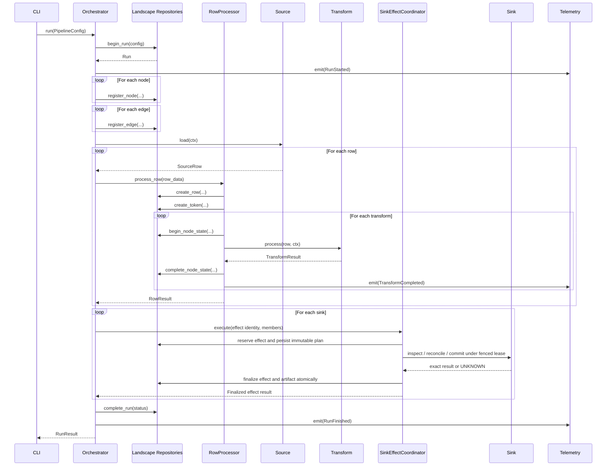

**Key audit points:**

1. `begin_run` - Configuration hash stored → Telemetry: RunStarted
2. `register_node/edge` - DAG structure recorded
3. `create_row/token` - Row identity established
4. `begin/complete_node_state` - Transform input/output hashes recorded → Telemetry: TransformCompleted
5. `reserve/finalize sink effect` - External publication plan, attempts, exact
   result, members, and artifact recorded; an uncertain result remains blocked
6. `complete_run` - Final status and timestamps → Telemetry: RunFinished

**Telemetry Pattern:** Events emitted AFTER Landscape recording (Landscape = source of truth, telemetry = operational visibility)

### Token Lifecycle

Tokens track row identity through forks, joins, and routing decisions.

```mermaid
stateDiagram-v2
    [*] --> Created: Source yields row
    Created --> Processing: Enter transform chain

    state Processing {
        [*] --> Transform
        Transform --> Transform: Continue
        Transform --> Gate: Route decision

        Gate --> Forked: fork_to_paths
        Gate --> Routed: route_to_sink
        Gate --> Transform: continue

        state Forked {
            [*] --> Child1
            [*] --> Child2
            Child1 --> Processing
            Child2 --> Processing
        }
    }

    Processing --> Completed: Reach output sink
    Processing --> Routed: Gate routes to sink
    Processing --> Quarantined: Validation failure
    Processing --> Failed: Processing error
    Processing --> ConsumedInBatch: Aggregated
    Forked --> Coalesced: Merge point

    Completed --> [*]
    Routed --> [*]
    Quarantined --> [*]
    Failed --> [*]
    ConsumedInBatch --> [*]
    Coalesced --> [*]
```

**Terminal states:**

| State | Meaning |
|-------|---------|
| `COMPLETED` | Reached output sink |
| `ROUTED` | Gate sent to named sink |
| `FORKED` | Split to multiple paths (parent token) |
| `CONSUMED_IN_BATCH` | Aggregated into batch |
| `COALESCED` | Merged at join point |
| `QUARANTINED` | Failed validation, stored for investigation |
| `FAILED` | Processing error, not recoverable |
| `EXPANDED` | Parent token for deaggregation (1→N expansion) |
| `BUFFERED` | Temporarily held in aggregation (non-terminal, becomes COMPLETED on flush) |

### Fork/Join Processing Flow

Detailed sequence showing how tokens split and merge through parallel paths.

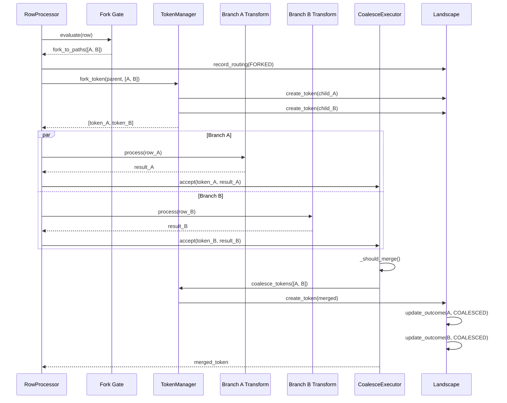

**Key Fork/Join Concepts:**

- **Fork Gate**: Creates N child tokens from 1 parent token (same row data, different paths)
- **Token Identity**: `row_id` stable, `token_id` unique per instance, `parent_token_id` for lineage
- **Coalesce Policies**: `require_all`, `quorum`, `best_effort`, `first`
- **Merge Strategies**: `union`, `nested`, `select`
- **Audit Trail**: Complete lineage from parent through children to merged output

---

## Deployment View

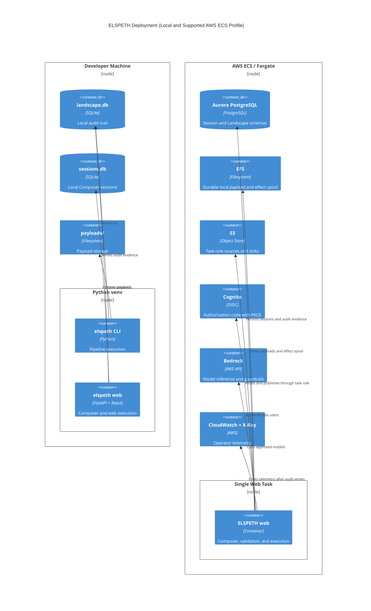

| Environment | Session store | Audit store | Payload/effect storage |
|-------------|---------------|-------------|------------------------|
| Development | SQLite | SQLite/SQLCipher | Local filesystem |
| Supported AWS ECS profile | Aurora PostgreSQL | Aurora PostgreSQL | EFS plus task-role S3 |

The 0.7.1 AWS profile supports one web task at a time. Validate-only startup,
the deployment doctor, readiness checks, and schema-owner separation are part
of the deployment contract; mixed-version rollout across the pre-1.0 schema
cutover is not supported.

---

## Telemetry Flow Diagram

Shows how operational events flow from pipeline components through the telemetry system to external observability platforms.

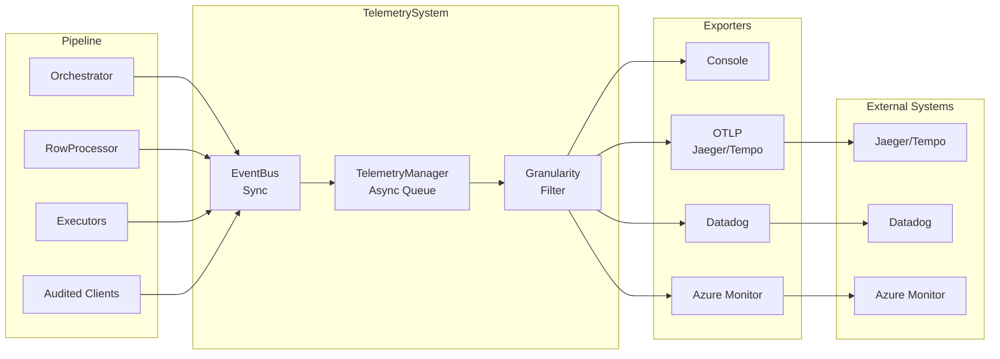

**Telemetry Granularity Levels:**

| Level | Events | Use Case |
|-------|--------|----------|
| `lifecycle` | Run start/complete, phase transitions (~10-20 events/run) | High-level monitoring |
| `rows` | Above + row creation, transform completion, gate routing (N×M events) | Detailed tracking |
| `full` | Above + external call details (LLM, HTTP, SQL) | Deep debugging |

**Backpressure Modes:**

- `block`: Wait for export completion (ensures all events delivered)
- `drop`: Drop events when queue full (fast, lossy)

**Key Pattern:** Telemetry is emitted AFTER Landscape recording. Individual exporter failures are isolated - one exporter failure doesn't affect others.

---

## Dependency Graph

Shows dependency relationships between major subsystems and the **leaf module principle**.

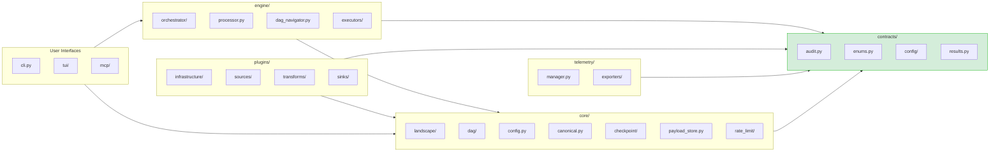

**Leaf Module Principle:** Contracts package has ZERO outbound dependencies, preventing circular imports and enabling independent testing.

**Import Hierarchy:**

```
UI Layer → Engine/Plugins/Telemetry → Core → Contracts (leaf)
```

---

## Schema Contract Validation Flow

Shows how plugin schemas are validated at DAG construction to prevent runtime type mismatches.

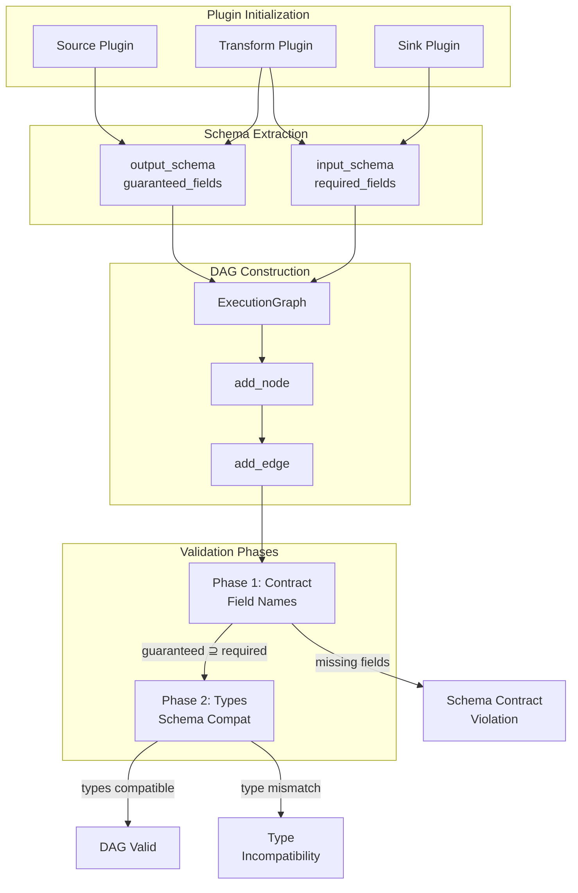

**Validation Rules:**

1. **Phase 1 (Contract)**: Upstream `guaranteed_fields` must be a superset of downstream `required_fields`
2. **Phase 2 (Types)**: Field types must be compatible across plugin boundaries
3. **Happens at**: DAG construction time (before any data processing)
4. **Failures**: Crash immediately with clear error message

**Example Template Discovery:**

```python
from elspeth.core.templates import extract_jinja2_fields

# Discover required fields from Jinja2 template
template = "Total: {{ quantity * price }}"
required = extract_jinja2_fields(template)
# → ["quantity", "price"]
```

---

## Trust Boundary Diagram

The Three-Tier Trust Model defines how data is handled at each boundary.

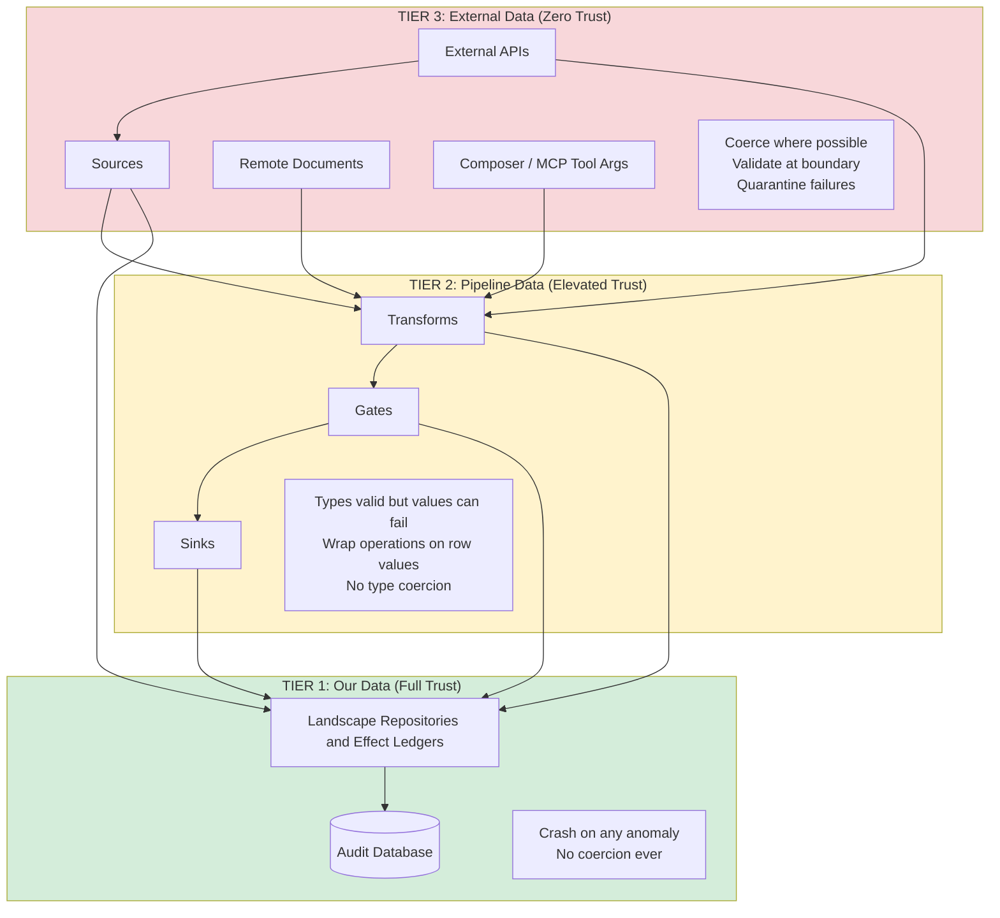

### Trust Tier Summary

| Tier | Trust Level | Coercion | On Error |
|------|-------------|----------|----------|
| **Tier 1** (Audit DB) | Full trust | Never | Crash immediately |
| **Tier 2** (Pipeline) | Elevated ("probably OK") | Never | Return error result |
| **Tier 3** (External) | Zero trust | At boundary | Quarantine row |

---

## Architecture Decision Records (ADRs)

ELSPETH uses ADRs to document significant architectural choices.

### Documented ADRs

| ADR | Title | Decision | Rationale |
|-----|-------|----------|-----------|
| **ADR-001** | Plugin-level concurrency | Pool-based with FIFO ordering | Maintains auditability while enabling parallelism |
| **ADR-002** | Routing copy mode limitation | Move-only (no copy) | Prevents ambiguous audit trail for routed tokens |
| **ADR-003** | Schema validation lifecycle | Two-phase (contract → type) at DAG construction | Catches mismatches before processing |
| **ADR-004** | Explicit sink routing | Named DAG edges replace implicit convention | Enables auditable routing decisions |
| **ADR-005** | Declarative DAG wiring | `input`/`on_success` connections | Every edge explicitly declared and validated |
| **ADR-006** | Layer dependency remediation | Strict 4-layer model (`contracts → core → engine → plugins`) | 10 violations → 0, CI enforcement |
| **ADR-007** | Pass-through contract propagation (AMENDED by ADR-009/010) | Add `passes_through_input: bool = False` to BaseTransform / TransformProtocol | Annotation is an unconditional contract that `process()` preserves every input field on every row |
| **ADR-008** | Runtime contract cross-check (AMENDED by ADR-009/010) | Per-row cross-check in `TransformExecutor.execute_transform` after `process()` returns | Catches pass-through contract violations at runtime; `PassThroughContractViolation` is `TIER_1_ERRORS` |
| **ADR-009** | Pass-through pathway fusion | Shared `verify_pass_through` primitive in `engine/executors/pass_through.py`; `compose_propagation()` aggregation rule | Closes duplicated walkers and single-path runtime cross-check; supersedes ADR-007 §Decision 1 / ADR-008 §Decision scope |
| **ADR-010** | Declaration-trust framework | Nominal `AuditEvidenceBase` ABC + `@tier_1_error` decorator + `DeclarationContract` protocol with frozen registry | Generalised contract protocol for plugin declarations; audit-complete dispatch raises `AggregateDeclarationContractViolation` when M > 1 |
| **ADR-011** | Declared output fields contract | `DeclaredOutputFieldsContract` adopter on `post_emission_check` and `batch_flush_check` | Per-emitted-row guarantee that runtime fields cover declared output fields |
| **ADR-012** | `can_drop_rows` governance contract | Add `can_drop_rows: bool = False` to BaseTransform / TransformProtocol; new terminal state `RowOutcome.DROPPED_BY_FILTER` | Retires ADR-009 Clause 3 carve-out; legitimate zero-emission success becomes queryable in Landscape, distinct from FAILED |
| **ADR-013** | Declared required input fields contract | New `declared_input_fields` runtime attribute; `DeclaredRequiredFieldsContract` on `pre_emission_check` | Runtime input not satisfying declared preconditions = audit-integrity problem; first adopter on the `pre_emission_check` surface |
| **ADR-014** | Schema config mode contract | `SchemaConfigModeContract` on `post_emission_check` and `batch_flush_check`; modes are `fixed` / `flexible` / `observed` | Verifies declared mode matches emitted contract.mode; for `fixed`, no undeclared extras |
| **ADR-015** | `creates_tokens` remains a permission flag | Path 1 chosen — `creates_tokens=True` means multi-row expansion permitted, not required | Dispatcher cannot distinguish "single-row is correct, expansion permitted" from "single-row is incorrect, expansion required" |
| **ADR-016** | Source guaranteed fields contract | `SourceGuaranteedFieldsContract` on `boundary_check`; new `declared_guaranteed_fields` runtime attribute | Runs after token creation in `RowProcessor.process_row()`, never on `process_existing_row()` (resume must not re-cross source boundary) |
| **ADR-017** | Sink required fields contract | Two-layer architecture: dispatcher-owned `SinkRequiredFieldsViolation` plus inline `SinkTransactionalInvariantError` backstop | The two signals must not be merged; runs before `_validate_sink_input()` and before sink I/O on both primary and failsink paths |
| **ADR-018** | Producer-site outcome discrimination | Keep producer-site predicate roles distinct across contracts, web schemas, and frontend readers | Prevents terminal-outcome counters from conflating where a decision was made with what happened next |
| **ADR-019** | Two-axis terminal model | Separate lifecycle/status from disposition/outcome and execution path | Makes terminal accounting explainable without overloading a single status enum |
| **ADR-020** | Retire batch-LLM transforms | Remove legacy provider-specific batch LLM transforms in favor of unified `llm` strategies | Reduces duplicate contract surfaces and concentrates provider dispatch in one transform |
| **ADR-021** | Sources and sinks uniformly boundary | Treat sources and sinks as architecture boundary components | Applies trust and contract enforcement consistently at ingress and egress |
| **ADR-022** | Shareable reviews | Add signed share tokens and composer completion events | Freezes reviewable composition state with auditable completion gestures |
| **ADR-023** | Custom Python CI analyzer | Maintain `elspeth-lints` for project-specific static invariants | Captures architecture and audit rules that general linters cannot express |
| **ADR-024** | Delivery governance for single-maintainer mode | Govern release and CI/CD delivery for single-maintainer operation | Makes delivery controls explicit where team-size assumptions do not apply |

### Implicit Architectural Decisions

| Technology | Choice | Rationale |
|------------|--------|-----------|
| **Database ORM** | SQLAlchemy Core (not ORM) | Audit trail needs precise SQL control, multi-DB support |
| **Plugin System** | pluggy | Battle-tested (pytest uses it), clean hook specifications |
| **Graph Library** | NetworkX | Industry-standard, topological sort, cycle detection |
| **Canonical JSON** | RFC 8785 (rfc8785 package) | Standards-based deterministic hashing |
| **Terminal UI** | Textual | Modern, cross-platform, active development |
| **Retry Library** | tenacity | Industry standard, declarative configuration |
| **Rate Limiting** | pyrate-limiter | Sliding window, SQLite persistence option |
| **Telemetry** | OpenTelemetry Protocol | Vendor-neutral, wide exporter support |

---

## Quality Assessment

Based on automated analysis, live registry checks, source-count refreshes, and
ongoing CI enforcement.

### Design Characteristics

| Dimension | Evidence |
|-----------|----------|
| **Maintainability** | Clean module boundaries, consistent patterns across subsystems |
| **Testability** | 2.6:1 test-to-production LOC ratio, mutation testing, property tests |
| **Type Safety** | mypy strict mode, runtime-checkable protocols, NewType aliases |
| **Documentation** | ADRs, runbooks, architecture docs, and trust-boundary guides |
| **Error Handling** | Three-tier trust model with distinct rules per boundary |
| **Security** | HMAC fingerprinting, AST-based expression parsing (no eval), SQLCipher support |
| **Performance** | Batch operations, connection pooling, rate limiting |
| **Complexity** | Some large files remain (orchestrator ~2,070 LOC, processor ~1,860 LOC) |

### Design Principles

1. **Auditability** - Complete traceability; "I don't know what happened" is never acceptable
2. **Three-Tier Trust Model** - Clear rules for data handling at each boundary
3. **Clean Layering** - Contracts as leaf module, CI-enforced layer dependencies
4. **Protocol-Based Design** - Runtime-checkable interfaces, structural typing
5. **No Legacy Code Policy** - Clean evolution, no backwards compatibility shims

### Areas for Future Improvement

| Area | Concern | Priority |
|------|---------|----------|
| **Large Files** | orchestrator/core.py (~2,070 LOC), processor.py (~1,860 LOC) | Medium |
| **Aggregation Complexity** | Multiple state machines (buffer/trigger/flush) | Medium |
| **Composite PK Queries** | `nodes` table joins require care | Low |
| **API Documentation** | No generated docs (pdoc/sphinx) | Low |

### Risk Assessment

| Category | Status | Evidence |
|----------|--------|----------|
| **Audit Integrity** | ✅ Low Risk | Tier 1 crash policy, NaN/Infinity rejected |
| **Type Safety** | ✅ Low Risk | mypy strict, runtime protocol verification |
| **Test Coverage** | ✅ Low Risk | 2.6:1 ratio, mutation testing, property tests |
| **Resume Safety** | ✅ Low Risk | Full topology hash (BUG-COMPAT-01 fix applied) |

---

## Summary

### Key Architectural Decisions

| Decision | Rationale |
|----------|-----------|
| **SQLAlchemy Core** (not ORM) | Audit trail needs precise SQL, not object mapping |
| **pluggy** | Battle-tested (pytest), clean hook system |
| **Canonical JSON** (RFC 8785) | Deterministic hashing for audit integrity |
| **Token-based lineage** | Tracks identity through forks/joins |
| **Three-tier trust** | Clear rules for coercion and error handling |
| **Leaf module principle** | Contracts package has zero outbound dependencies |

### What This Document Covers

1. **Context** - How ELSPETH fits in the system landscape
2. **Containers** - 11 major subsystems across 5 architectural tiers
3. **Components** - Internal structure of Engine, Landscape, Plugins (with LOC counts)
4. **Data Flow** - Pipeline execution and fork/join processing with telemetry
5. **Token Lifecycle** - State transitions for row processing (9 terminal states)
6. **Deployment** - Development and production configurations
7. **Trust Boundaries** - Three-tier data trust model
8. **Telemetry Flow** - Real-time operational visibility alongside audit trail
9. **Dependency Graph** - Subsystem relationships and leaf module principle
10. **Schema Validation** - Contract enforcement at DAG construction
11. **ADRs** - Documented architectural decisions
12. **Quality Assessment** - Design characteristics and risk analysis

**Key Metrics:**

- Production LOC: ~236,100 (598 Python files in `src/elspeth/`; frontend TSX/CSS not included)
- Test LOC: ~619,900 (1,391 Python files, 2.6:1 ratio)
- Subsystems: 11 major (20+ including sub-components)
- Plugins: registry-discovered via `discover_all_plugins()` — the same code path as `elspeth plugins list`
- ADRs: 30+ accepted records (excluding the 000 template)
- Status: Pre-release (0.7.1)

All diagrams use Mermaid syntax for version control compatibility.

---

## See Also

- [README.md](README.md) - Project overview and quick start
- [PLUGIN.md](PLUGIN.md) - Plugin development guide
- [docs/reference/](docs/reference/) - Configuration reference
