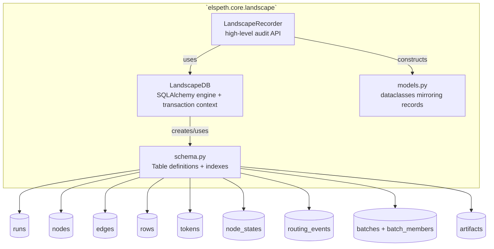
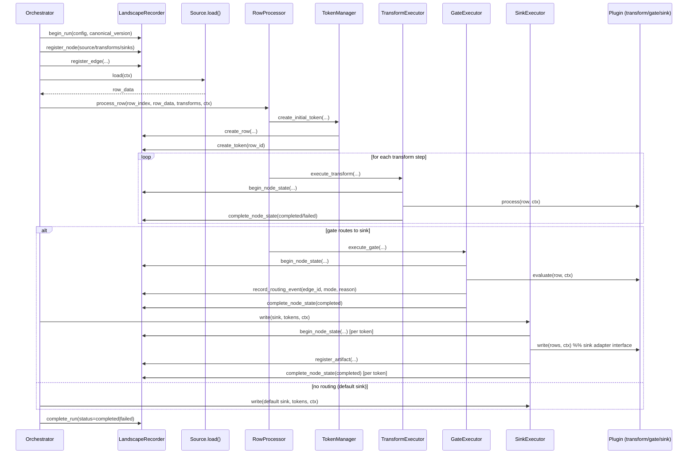

# Architecture Diagrams (Current Implementation)

These diagrams reflect the **current code** under `src/elspeth/` (not the full future design in `docs/design/architecture.md`). Where the design mentions features not yet wired (e.g., full DAG execution, CLI), those are marked as planned.

## 1) System Context (C4-ish)

```mermaid
flowchart TB
  dev[Pipeline Author / Operator]
  cfg[(settings.yaml / env vars)]
  pluginpack[Plugin Pack<br/>user-defined Sources/Transforms/Gates/Sinks]
  src[(Source Data<br/>CSV / API / DB)]
  sinks[(Sinks<br/>files / DB / APIs)]
  db[(Landscape DB<br/>SQLite/Postgres)]
  payloads[(Payload Store<br/>filesystem CAS)]
  otel[(OpenTelemetry Collector)]

  elspeth[ELSPETH Runtime<br/>Python package `elspeth`]

  dev -->|configures| cfg
  dev -->|provides| pluginpack
  elspeth -->|loads config (planned)| cfg
  elspeth -->|executes plugins| pluginpack
  pluginpack -->|reads| src
  pluginpack -->|writes| sinks
  elspeth -->|writes audit trail| db
  elspeth -->|stores/retrieves large blobs (partial)| payloads
  elspeth -->|emits spans (optional)| otel
```

## 2) Package Containers (Core / Engine / Plugins)

```mermaid
flowchart TB
  subgraph pkg[Python package: `elspeth`]
    subgraph core[`elspeth.core`]
      canonical[`core.canonical`<br/>RFC8785 canonical JSON + stable_hash]
      config[`core.config`<br/>Dynaconf + Pydantic settings]
      dag[`core.dag`<br/>ExecutionGraph wrapper (planned integration)]
      payload_store[`core.payload_store`<br/>CAS payload storage]
      landscape[`core.landscape`<br/>audit DB + recorder]
    end

    subgraph engine[`elspeth.engine`]
      orch[`engine.orchestrator`<br/>run lifecycle]
      proc[`engine.processor`<br/>row loop (linear)]
      execs[`engine.executors`<br/>audit-wrapped plugin calls]
      tokens[`engine.tokens`<br/>TokenManager/TokenInfo]
      spans[`engine.spans`<br/>SpanFactory]
      retry[`engine.retry`<br/>RetryManager (available)]
    end

    subgraph plugins[`elspeth.plugins`]
      protocols[`plugins.protocols`<br/>typed plugin contracts]
      results[`plugins.results`<br/>TransformResult/GateResult/etc]
      schemas[`plugins.schemas`<br/>schema + compatibility]
      ctx[`plugins.context`<br/>PluginContext]
      mgr[`plugins.manager` + `hookspecs`<br/>pluggy registration]
      enums[`plugins.enums`<br/>NodeType/Determinism/etc]
    end
  end

  subgraph usercode[User/Org code (outside repo)]
    impls[Concrete plugin implementations]
  end

  orch --> proc
  proc --> execs
  proc --> tokens
  execs --> spans
  retry -.-> execs

  orch --> landscape
  proc --> landscape
  execs --> landscape
  tokens --> landscape

  execs --> canonical
  landscape --> canonical

  impls --> protocols
  impls --> results
  impls --> schemas
  impls --> ctx
  mgr --> impls

  %% Known layering tension: core imports plugin enums for NodeType/Determinism
  landscape --> enums
```

## 3) Engine Components (Key Runtime Interactions)

```mermaid
flowchart TB
  subgraph engine[`elspeth.engine`]
    orch[Orchestrator]
    proc[RowProcessor]
    tm[TokenManager]
    texec[TransformExecutor]
    gexec[GateExecutor]
    aexec[AggregationExecutor]
    sexec[SinkExecutor]
    spans[SpanFactory]
    rtry[RetryManager (not currently wired)]
  end

  subgraph plugins[Plugin instances (duck-typed)]
    source[Source: load()/close()]
    transform[Transform: process()]
    gate[Gate: evaluate()]
    agg[Aggregation: accept()/flush()]
    sink[Sink adapter: write(rows)->artifact info]
  end

  subgraph core[`elspeth.core.landscape`]
    recorder[LandscapeRecorder]
    db[(LandscapeDB)]
  end

  orch -->|begin_run/register nodes+edges/complete_run| recorder
  recorder --> db

  orch -->|ctx=PluginContext(run_id, config, landscape=recorder)| proc
  orch -->|iterates| source
  source -->|yields rows| proc

  proc -->|create_initial_token| tm
  tm -->|create_row/create_token| recorder

  proc -->|per step| texec
  texec -->|begin_node_state/complete_node_state| recorder
  texec --> transform

  proc -->|per step| gexec
  gexec -->|record_routing_event(s)| recorder
  gexec -->|may fork tokens| tm
  gexec --> gate

  proc -->|per step| aexec
  aexec -->|create_batch/add_batch_member/update_batch_status| recorder
  aexec --> agg

  orch -->|write buffered tokens| sexec
  sexec -->|begin_node_state/complete_node_state/register_artifact| recorder
  sexec --> sink

  texec --> spans
  gexec --> spans
  aexec --> spans
  sexec --> spans

  rtry -.-> texec
```

## 4) Landscape Components (Audit Data Plane)



## 5) Sequence: Single Row Through Linear Pipeline (Happy Path + Gate Routing)



