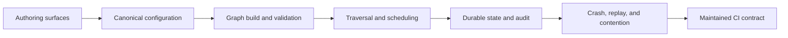

# DAG Completeness Model

## Definition

A DAG capability is complete only when it survives the full product chain:

A node type existing in the model proves only representation. A happy-path test proves only execution. Production completeness requires equivalent behavior across authoring, compilation, execution, durable recovery, evidence, and maintenance.

## Rating scale

Apply the scale to one named layer or one scenario cell at a time. A topology-model or structural-validation layer can score 4 locally while the end-to-end product remains incomplete because recovery, authoring, or security fails. The hard gates and the minimum mandatory scenario cells determine the product verdict.

| Score | Meaning | Required evidence |
| ---: | --- | --- |
| 0 | Unsupported | No supported representation. |
| 1 | Modeled | The model can represent it, but supported compilation is absent or unsafe. |
| 2 | Compiles | Canonical configuration builds and validates. |
| 3 | Happy-path supported | A production-path execution test passes. |
| 4 | Production-supported for the assessed layer | The layer's production-path positive, negative, and maintenance evidence passes; an end-to-end scenario additionally requires failure, recovery, contention, audit, and every advertised authoring surface. |
| 5 | Maintained contract | Score 4 plus versioned contract, mandatory CI, negative tests, scale envelope, and ownership. |
| U | Unknown | Evidence is absent, skipped, planned, or not production-path representative. |

## Hard gates

Regardless of average score, the DAG is not complete when any of these are true:

- a supported path can lose or duplicate data;
- a stale worker can mutate protected state;
- replay can repeat non-idempotent effects without a declared boundary;
- graph identity, metadata, export, or diagnostics can reveal secrets;
- an advertised authoring surface cannot represent a mandatory topology;
- a mandatory scenario remains unknown or skipped;
- the normative contract materially contradicts live code.

## Mandatory assessment dimensions

1. **Topology expressiveness:** roots, terminals, routes, fan-out, queue fan-in, sibling joins, aggregation, and expansion.
2. **Compositional closure:** supported constructs remain valid when nested or sequenced.
3. **Cardinality:** one-to-one, one-to-many, many-to-one, batch, and row-union semantics are explicit.
4. **Structural validation:** invalid cycles, reachability, names, fan-in, destinations, and labels fail before execution.
5. **Schema contracts:** guarantees propagate correctly and invalid contracts fail closed.
6. **Runtime semantics:** routing, branch accounting, merge policies, sinks, and failures match the graph.
7. **Recovery:** every durable seam has deterministic restart behavior.
8. **Concurrency:** ownership, leases, CAS, fencing, and idempotency hold across processes.
9. **Auditability:** state and its explanation commit atomically and lineage remains attributable.
10. **Security:** runtime secrets stay outside public graph identity and metadata.
11. **Authoring parity:** freeform, guided, import/export, and browser workflows compile equivalent graphs.
12. **Scale and maintenance:** supported limits are measured and the matrix is mandatory in CI.

## Mandatory scenario corpus

| Scenario | Minimum proof |
| --- | --- |
| Linear source→transform→sink | Parse, build, execute, audit, replay. |
| Multiple independent sources | Per-source identity, ordering, audit, and restart. |
| Multi-source queue fan-in | Producer membership, deterministic scheduling, and contention. |
| Conditional routing | Every route, discard, error, and missing destination. |
| Fork to multiple terminals | Copy identity, branch outcomes, and partial failure. |
| Fork and coalesce | Every completion policy and merge strategy. |
| Sequential/nested forks and coalesces | Real builder, traversal plan, runtime, and restart. |
| Parallel coalesces | Independent readiness, ordering, and contention. |
| Aggregation | Batch closure, membership immutability, failure, and replay. |
| Row expansion | Child identity, parent disposition, crash recovery, and no duplicate children. |
| Row union/interleave | Explicit supported construct or explicit product limitation. |
| Error/quarantine/retry/discard | Durable disposition, audit, branch loss, and restart. |
| Sink write/redrive | Idempotency, pending bundle, claim subtype, and late-worker fencing. |
| Checkpoint/resume | Topology identity, secret safety, and deterministic continuation. |
| Multi-worker execution | Registered processes, claim epochs, lease expiry, and clean losers. |

## Evidence matrix columns

Track each scenario with these columns:

| Column | Question |
| --- | --- |
| Config accepted | Can supported configuration express the scenario? |
| Graph built | Does the production builder create the expected canonical graph? |
| Contracts valid | Do structural, schema, cardinality, and plugin contracts pass? |
| Runtime | Does production traversal produce the expected result? |
| Audit | Does the evidence explain every state and route? |
| Recovery | Does restart at every durable seam preserve exactly-once internal effects? |
| Concurrency | Do multiple processes preserve ownership, fencing, and idempotency? |
| Freeform/guided | Can every advertised authoring surface construct it? |
| Round-trip | Does import/export preserve the canonical graph? |
| Scale | Does it remain within declared limits? |

## Completion rule

Declare the DAG complete only when every mandatory scenario scores at least 4 in every mandatory dimension, no cell is unknown, no hard gate is open, and the matrix runs as a required CI contract. Score 5 requires a named owner, versioned contract, supported scale envelope, and release-gated maintenance.
