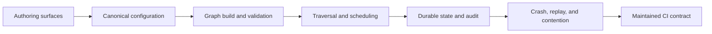

# DAG Completeness Criteria

**Status:** Evergreen assessment contract
**Applies to:** Elspeth's executable directed acyclic graph (DAG) as an end-to-end product
**Last reviewed:** 2026-07-15

## Purpose

These criteria define what Elspeth means when it calls its DAG "complete." They
are deliberately stricter than "the graph can represent this topology" or "the
happy path passes." A supported capability must survive the full product chain:

A capability is complete only when supported configuration can express it, the
production builder compiles it into the canonical graph, validation rejects
invalid variants, runtime and recovery preserve its semantics, audit evidence
explains the result, and every advertised authoring surface round-trips it
without semantic loss.

## Product boundary

The DAG completeness boundary includes:

- runtime and Composer configuration;
- canonical graph construction and structural validation;
- schema, cardinality, routing, join, aggregation, and expansion contracts;
- traversal-plan compilation and plugin binding;
- scheduling, durable state, sink delivery, and checkpoint/resume;
- crash recovery, replay, lease expiry, fencing, and multi-process contention;
- audit, lineage, diagnostics, export, and topology identity;
- freeform, guided, import/export, and browser authoring surfaces; and
- versioned contracts, scale limits, ownership, and required CI evidence.

It does not mean that every imaginable graph primitive must exist. A deliberately
unsupported capability is acceptable when the product rejects it consistently
and documents the supported alternative. Ambiguous or accidentally partial
support is not acceptable.

## Evidence and rating scale

Apply a score to one named dimension or one scenario cell at a time. Scores are
layer-local: a structural-validation score of 4 does not imply that recovery or
authoring also scores 4.

| Score | Maturity | Required evidence |
| ---: | --- | --- |
| 0 | Unsupported | No supported representation; rejection may also be undefined. |
| 1 | Modeled | The model can represent the construct, but supported compilation is absent or unsafe. |
| 2 | Compiles | Canonical configuration builds and validates through the production path. |
| 3 | Happy-path supported | A production-path execution test produces the expected result. |
| 4 | Production-supported | Positive, negative, failure, recovery, concurrency, audit, and advertised-authoring evidence pass for the assessed scope. |
| 5 | Maintained contract | Score 4 plus a versioned contract, mandatory CI, scale envelope, named ownership, and release-gate maintenance. |
| U | Unknown | Evidence is absent, skipped, plan-only, stale, or not production-path representative. |

Unknown is a result, not a request to infer success. Manually assembled graphs,
unit-only helper tests, historical claims, and skipped specifications cannot by
themselves establish production support.

## Mandatory criteria

| Criterion | Complete when | Minimum evidence |
| --- | --- | --- |
| Topology expressiveness | Every supported root, terminal, route, fork, queue fan-in, sibling join, aggregation, and expansion has an explicit canonical representation. | Capability inventory plus positive and unsupported-case tests. |
| Canonical configuration | Equivalent supported inputs normalize to the same graph meaning without relying on YAML order or authoring-surface quirks. | Canonical graph comparison across inputs and authoring surfaces. |
| Structural validation | Cycles, unreachable nodes, invalid roots/terminals, illegal fan-in, duplicate labels, and missing destinations fail before execution. | Production-builder negative tests with stable diagnostics. |
| Schema contracts | Field guarantees, required fields, observed/explicit modes, and join schemas propagate conservatively and fail closed. | Edge and composition matrices, including plugin-declaration negative tests. |
| Cardinality and identity | One-to-one, one-to-many, many-to-one, batch, row-union, and terminal effects have explicit token/row identity rules. | Durable identity assertions for execution, replay, and contention. |
| Compositional closure | Supported constructs remain valid when nested, sequenced, or placed after structural nodes. | Real-builder and runtime tests for sequential and parallel compositions. |
| Runtime semantics | Routing, branch accounting, merge policy, aggregation, expansion, failure policy, and sink delivery match the canonical graph. | Production traversal with exact rows, tokens, routes, and terminal outcomes. |
| Durable recovery | Restart at every durable seam preserves the declared result without loss or duplicate effective work. | Deterministic fault injection and restart from the same database. |
| Concurrency and fencing | Exactly one effective owner mutates each claim epoch; stale or losing workers cannot commit protected effects. | Real multi-process claim, lease-expiry, reclaim, and late-worker tests. |
| Atomic evidence | State and its explanation commit or roll back together; lineage remains attributable across retries and joins. | Transaction-failure tests for state, events, reasons, outcomes, and journal writes. |
| Security | Runtime secrets never enter public graph identity, metadata, exports, diagnostics, checkpoints, or audit evidence. | Redaction/fingerprinting contract plus secret-form regression scans. |
| Authoring parity | Every advertised authoring surface can express the supported topology set and rejects the same invalid semantics. | Freeform, guided, import/export, and browser parity matrix. |
| Semantic round-trip | Import, no-op edit, export, and re-import preserve canonical graph semantics rather than textual formatting. | Canonical before/after equality for every mandatory fixture. |
| Scale | Supported topology and runtime limits are measured, declared, and enforced or monitored. | Repeatable benchmarks with release thresholds and failure behavior. |
| Maintained contract | Normative docs, examples, tracker state, source, and required tests agree on supported behavior. | Versioned contract, CI gate, owner, and issue reconciliation. |

## Hard gates

The DAG is **not complete**, regardless of average score, while any of these is
true:

- a supported path can lose, duplicate, cross-run, or ambiguously subtype work;
- replay can repeat a non-idempotent effect without a declared external boundary;
- a stale worker can mutate protected state;
- state can commit without its audit explanation, or evidence can commit without state;
- graph identity, metadata, export, diagnostics, or audit can reveal raw secrets;
- an advertised authoring surface cannot represent a mandatory supported topology;
- a mandatory scenario contains an unknown, skipped, or plan-only cell;
- the normative contract materially contradicts live code; or
- a claimed scale limit lacks repeatable evidence.

A high average cannot compensate for a hard-gate failure.

## Mandatory scenario corpus

Every assessment must cover these scenarios or record an explicit, consistent
product limitation:

1. Linear source → transform → sink.
2. Multiple independent sources.
3. Multi-source queue fan-in.
4. Conditional routing, including missing and error destinations.
5. Fork to multiple terminals with partial failure.
6. Fork and coalesce across every completion policy and merge strategy.
7. Sequential or nested forks and coalesces.
8. Parallel coalesces.
9. Aggregation, batch closure, and immutable membership.
10. Row expansion with parent/child identity and recovery.
11. Row union or interleave, whether supported or consistently rejected.
12. Retry, quarantine, discard, and routed error handling.
13. Sink write and pending-sink redrive.
14. Checkpoint and deterministic resume.
15. Multi-worker execution, lease expiry, reclaim, and late completion.

For a scenario to reach score 4, evidence must cover the production builder and
runtime plus every applicable recovery, concurrency, audit, authoring, and
round-trip cell. Direct `ExecutionGraph` construction proves graph algorithms,
not the production configuration-to-runtime chain.

## Completion rule

Declare the DAG complete only when:

- every mandatory scenario scores at least 4 in every applicable mandatory dimension;
- no mandatory cell is unknown, skipped, or plan-only;
- no hard gate is open;
- equivalent authoring inputs produce the same canonical graph and traversal plan;
- all required evidence runs in CI; and
- the normative contract and supported scale envelope name their owners.

Score 5 additionally requires the criteria, scenario corpus, and limits to be
versioned release contracts whose regressions block release.

## Relationship to other documents

- [`assessment-framework.md`](assessment-framework.md) defines how to apply these criteria.
- [`README.md`](README.md) points to the current verdict and assessment history.
- [`../../contracts/execution-graph.md`](../../contracts/execution-graph.md) describes the execution-graph contract; an assessment checks that contract against live behavior.
- [`../state_engine/README.md`](../state_engine/README.md) is the canonical durable state-engine architecture and assessment authority.
