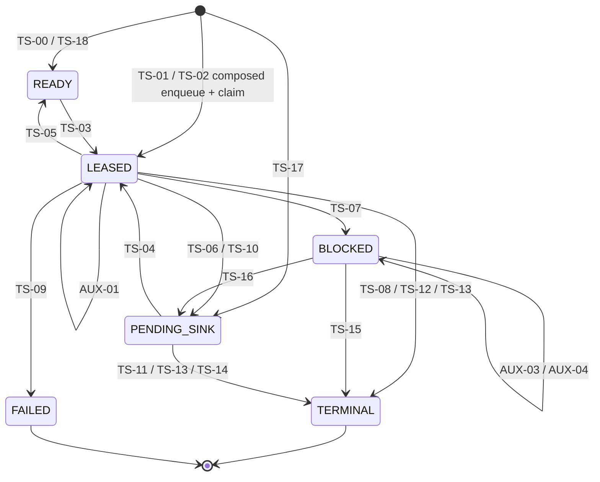
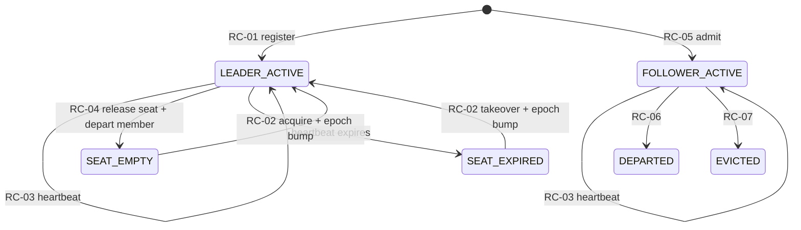
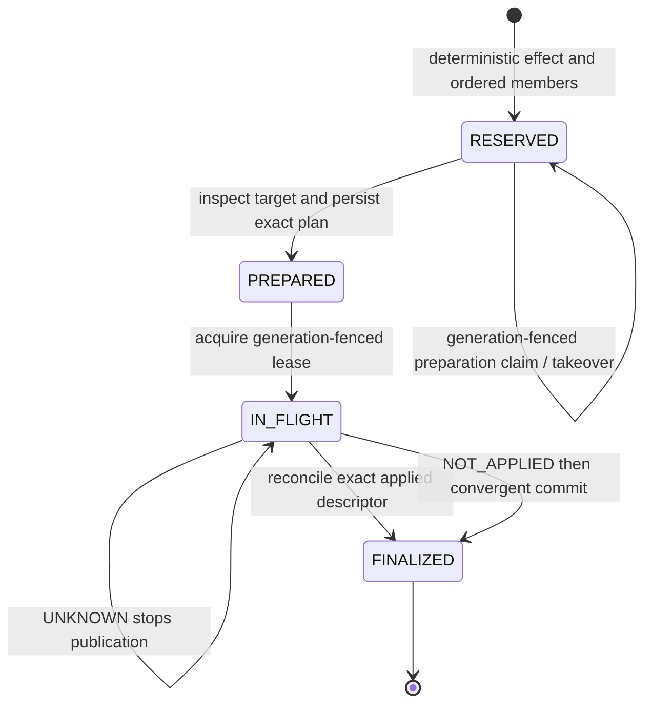
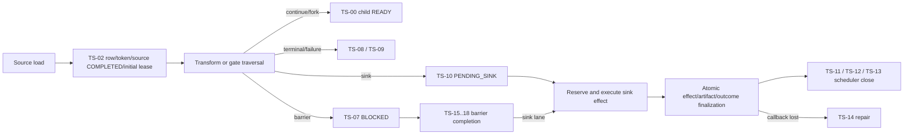

# State Engine Architecture

This document describes the current durable state engine at the code baseline
named by the hub. It describes implementation and invariants, not evidence
status. Use the [proof matrix](proof-matrix.md) for current proof and gap
classification.

## Scope

The state engine comprises four coupled durable mechanisms:

1. token work scheduling and disposition;
2. barrier/coalesce adoption and completion;
3. sink-effect publication and reconciliation;
4. orchestration read models and coordination fences.

The engine holds no scheduler write transaction across source, transform, or
sink plugin I/O. That design keeps database transactions bounded but creates
cross-transaction seams that require durable continuation authority and fresh-
process restart proof.

## Token scheduler

### States

The status column alone is not the state vocabulary. Durable discriminator
fields define these subtypes:

| Status | Durable subtype | Discriminator and authority |
| --- | --- | --- |
| `LEASED` | Transform lease | `pending_sink_name IS NULL`; the exact lease owner may use TS-07–TS-10. |
| `LEASED` | Sink-redrive lease | Complete pending-sink bundle is non-null; TS-04 wrote the current lease owner and only TS-12/TS-13 may terminalize it. |
| `PENDING_SINK` | Attributed sink debt | Complete bundle, non-null `lease_owner`, null expiry; TS-11/TS-13 use strict owner and leader authority. |
| `PENDING_SINK` | Recovered ownerless sink debt | Complete bundle, null owner and expiry after TS-06 deposes the prior owner; ordinary TS-11/TS-13 close must pass through TS-04, while TS-14 may repair it directly from a terminal durable outcome witness. |
| `BLOCKED` | Barrier hold | `barrier_key IS NOT NULL`; aggregation and coalesce identity are meanings encoded within this arm. |
| `BLOCKED` | Queue-only hold | `barrier_key IS NULL` and `queue_key IS NOT NULL`; no general production release is currently established. |

A queue-only hold remains dormant until reachability and release authority are
positively established.

### Transition families

| IDs | Responsibility |
| --- | --- |
| TS-00–TS-04 | Enqueue, composed initial claim, source ingest, READY claim, and pending-sink claim |
| TS-05–TS-06 | Expired transform and sink-redrive recovery |
| TS-07–TS-10 | Claimed transform dispositions |
| TS-11–TS-14 | Sink terminalization, bulk close, and outcome-witness repair |
| TS-15–TS-18 | Barrier consume, sink handoff, and atomic continuation emission |
| AUX-01–AUX-07 | Heartbeat, lease loss, adoption, branch-loss cursor, membership, and leader fencing |
| RC-01–RC-07 | Leader seat and worker-registry lifecycle |

The exact stable leg list and required cases live in the
[v1 catalog](proof-catalog/v1/catalog.json).

### Write ownership

Direct `token_work_items` mutations remain confined to the scheduler repository
implementation under:

- `src/elspeth/core/landscape/scheduler/work_items.py`;
- `src/elspeth/core/landscape/scheduler/leases.py`;
- `src/elspeth/core/landscape/scheduler/dispositions.py`;
- `src/elspeth/core/landscape/scheduler/barrier.py`.

`scheduler_repository.py` is the facade. Engine code reaches state through that
facade rather than writing scheduler rows directly.

## Fail-closed authority

Production leader-fenced operations require a `CoordinationToken`. The strict
path rejects `None` before opening the scheduler mutation:

- `src/elspeth/core/landscape/scheduler/fencing.py` owns strict selection;
- legacy unfenced recovery is separately named and restricted to direct
  recovery/testing contexts;
- barrier completion, adoption, branch-loss adoption, sink terminalization,
  and repair require explicit authority;
- registered worker claim/disposition paths bind worker membership.

Source completion has a similarly narrow compatibility boundary. Current
TS-02 ingress writes the exact step-0 source `COMPLETED` witness in the same
fenced transaction as the row, token, work item, initial lease, and scheduler
events. `SourceCompletionReconciler` exists only for pre-fix durable images
that committed TS-02 without that witness. It validates the whole image before
plugin execution and refuses ambiguity rather than weakening current ingress.

Missing authority never silently selects a weaker production write path.
Stale epoch, owner, membership, status, subtype, and work-item identity are
compare-and-swap guards, not advisory observations.

## Run coordination

The scheduler's mutation authority depends on a separate durable coordination
machine owned by `run_coordination_repository.py`:

`RC-01` creates the epoch-1 seat and leader membership together. `RC-02`
admits only an empty or expired seat and increments the epoch so the previous
leader's `CoordinationToken` becomes stale. `RC-03` always heartbeats active
membership and extends the seat only for its current leader. `RC-04` clears
the seat and departs leader membership as one repository call. `RC-05` requires
a live seat before follower registration; `RC-06` and `RC-07` terminalize
membership by departure or leader-fenced dead-worker eviction.

Two enforcement gaps are part of the current architecture, not hidden behind
caller assumptions. `release_seat()` may update membership even when its seat
CAS loses, and that membership predicate is not run-scoped. `evict_worker()`
relies on RM-08 caller preselection rather than independently refusing the
leader role. RC-04 and RC-07 therefore remain hard-gate gaps until the
repository predicates and zero-mutation loser images are proved.

Coordination events are mandatory state evidence for registration, takeover,
release, admission, departure, and eviction. A normal RC-03 heartbeat updates
membership and possibly the seat without emitting an event; proof must assert
that exact absence rather than inventing evidence. `RM-07` returns an occupied
seat snapshot with a derived `seat_live` flag, including an expired occupied
seat. `RM-08` applies a caller-supplied grace interval before selecting dead
non-leader members.

## Barrier and coalesce state

Claimed aggregation/coalesce work enters `BLOCKED` before leader intake.
Adoption uses durable markers and, for aggregation, durable batch membership and
BUFFERED outcome evidence. `complete_barrier` consumes the exact firing snapshot
and may atomically emit:

- no successor (`TS-15` consume only);
- a passthrough pending-sink row (`TS-16`);
- a new terminal-lane pending-sink row (`TS-17`);
- a READY continuation (`TS-18`).

Coalesce now materializes deterministic effect identity, parent membership,
merged token identity, and terminal parent evidence before marking the effect
complete. Repository atomicity is strong; the full production process-death
restart discriminator remains mandatory evidence.

Aggregation transform-mode continuation differs: a successful barrier consume
can commit before non-sink child scheduling. The TS-15-to-child-TS-00 seam
therefore remains a live architecture/proof gap.

## Sink-effect state machine

Every non-empty production sink batch uses the recoverable sink-effect protocol.
Legacy `write()`/`flush()` calls are not a production publication path.

The durable model includes:

- target streams and predecessor ordering;
- effects with protocol version, input identity, lifecycle, lease owner,
  generation, and exact plan;
- ordered effect members and per-member evidence;
- effect attempts and external-call intent/result;
- artifact and token-outcome finalization in one Landscape transaction.

`RESERVED` has two durable subtypes. An unclaimed reservation has no active
preparation owner. A preparation-claimed reservation persists owner,
generation, heartbeat, and expiry while target inspection and adapter
preparation execute. Expired preparation claims may be taken over with a
generation bump; immutable plan binding is fenced to the winning claim. Death
between claim, inspection, and plan binding is therefore an explicit PB-06
contention/restart surface, not merely part of `PREPARED` execution.

The production seam is implemented by:

- `src/elspeth/contracts/sink_effects.py` — closed immutable protocol values;
- `src/elspeth/core/landscape/execution/sink_effects.py` — repository facade;
- `src/elspeth/core/landscape/execution/sink_effect_lifecycle.py` — plans,
  leases, attempts, reconciliation, and takeover;
- `src/elspeth/core/landscape/execution/sink_effect_finalization.py` — node
  state, artifact, outcome, member, and effect finalization;
- `src/elspeth/engine/executors/sink_effects.py` — production coordinator.

Reconciliation has a closed result vocabulary:

- `NOT_APPLIED`: the coordinator may commit once;
- `APPLIED_WITH_EXACT_DESCRIPTOR`: finalize without another commit;
- `UNKNOWN`: fail closed and retain durable sink debt.

After effect finalization, scheduler close is a separate callback. If process
death occurs after token outcomes commit but before callback completion,
`TS-14` repairs the scheduler row from the durable outcome witness without
republication.

## Production boundary flow

### Plugin boundaries

| ID | Boundary | Durable consequence |
| --- | --- | --- |
| PB-01 | Source ingress | Accepted rows use TS-02, including the exact source `COMPLETED` witness. Before plugin execution, resume repairs only an exact pre-fix TS-02 image and rejects malformed or conflicting evidence; pre-row and quarantine failures deliberately create no scheduler row. |
| PB-02 | Transform | Results route to TS-00, TS-07, TS-08, TS-09, or TS-10. |
| PB-03 | Declarative gate | Engine evaluation routes through the same dispositions. |
| PB-04 | Aggregation | Barrier adoption, batch plugin execution, consume, and later continuation. |
| PB-05 | Coalesce | Durable merge effect and atomic barrier completion. |
| PB-06 | Sink effect | Reserve, claim preparation, inspect, plan, lease, reconcile/commit, and finalize. |
| PB-07 | Post-sink repair | TS-14 closes durable scheduler debt without external I/O. |
| PB-08 | Follower | Claims and row-level traversal; leader retains barrier and sink authority. |
| PB-09 | Lifecycle | Fresh/resume/follower start and normal/exceptional teardown ordering. |

## Read-model authority

Read models do not mutate state, but they decide whether orchestration may
flush, resume, relinquish, evict, or complete:

| ID | Decision |
| --- | --- |
| RM-01 | Unresolved producer work |
| RM-02 | Work that can still create barrier arrivals |
| RM-03 | Active-work/run-success backstop |
| RM-04 | Peer-owned work |
| RM-05 | In-memory continuation relinquishment |
| RM-06 | Active peer lease at resume guard |
| RM-07 | Occupied leader-seat snapshot and `seat_live` at follower/takeover admission |
| RM-08 | Grace-adjusted dead non-leader worker selection for eviction |
| RM-09 | Active source-row scheduler identities for mixed-state resume refusal |
| RM-10 | Barrier-blocked token identities excluded from redrive |
| RM-11 | Barrier-backed BLOCKED count for completion and resume preflight |
| RM-12 | Barrier-backed BLOCKED listing for journal restoration |
| RM-13 | Pending barrier-adoption listing for leader intake |

Each truth table must cover positive and negative status/subtype arms, run and
owner scoping, exact expiry equality, deduplication, and ordering. Scattered
positive assertions do not establish a complete read-model claim.

## Durable transaction boundaries

The following current boundaries are intentionally separate transactions and
therefore need explicit continuation/restart evidence. The compatibility row
records the closed pre-fix TS-02 seam. The sink rows enumerate the PB-07 case
list; that catalog list remains the machine authority.

| First durable action | Later action | Current status |
| --- | --- | --- |
| Pre-fix TS-02 row/token/initial-claim image without source state | Resume drain and plugin traversal | Closed compatibility seam: before plugin execution, `SourceCompletionReconciler` requires a root `LEASED` work item at attempt 1/step 1, exactly one matching current-work-item `ENQUEUE` and `CLAIM_READY`, matching row/token/ingest/payload hashes, and no conflicting source state. It inserts one exact source `COMPLETED` witness; repeat repair is idempotent and every ambiguity fails closed. Current TS-02 ingress no longer creates this image. |
| TS-00 child enqueue | Parent disposition | P1 crash seam; `elspeth-7cdc4da434` |
| Plugin call begins under scheduler lease | Next heartbeat/disposition | P1 long-call characterization; `elspeth-51a4b5c771` |
| TS-15 aggregation consume | Non-sink child TS-00 scheduling | Durable continuation authority incomplete |
| Plugin return or visible side effect | Terminal node-state audit | Ordinary transform process-death proof incomplete |
| Before/after sink-effect reservation | Preparation claim and target inspection | Deterministic reservation and generation-fenced preparation ownership must be reusable after restart |
| Preparation claim / target inspection | Immutable plan CAS | Death or takeover must not bind a plan from a stale preparation generation |
| Persisted plan | Generation-fenced lease and reconcile/commit | Takeover must preserve plan identity and one effective publisher |
| External publication | Returned response and attempt evidence | Lost response must reconcile; `UNKNOWN` must block rather than guess |
| Returned response | Atomic effect/member/artifact/outcome finalization | Restart must reuse the exact result or reconcile without another publication |
| Effect finalization | Coordinator response/reuse | A repeated caller must observe the finalized winner without committing again |
| Sink effect finalization/outcome | TS-11/TS-12/TS-13 scheduler callback | TS-14 repair exists; integrated callback-loss proof remains mandatory |

The sink-effect coordinator also holds a generation-fenced lease while calling
external reconcile/commit. A heartbeat API exists, but current production-path
heartbeat behavior during a long external call requires direct proof. Treat
duplicate publication as a risk/proof gap until a deterministic takeover test
demonstrates the outcome.

## Forbidden paths

`F-01` through `F-13` cover illegal final-state jumps, foreign barrier release,
wrong-owner dispositions, missing release keys, absent membership, unsafe
recovery, partial sink batches, non-exhaustive barrier completion, stale leader
mutation, source-boundary queue entry, deleted `WAITING`, and dormant queue-only
release.

Forbidden paths require positive refusal and zero-mutation evidence. Absence of
a located caller is not proof of unreachability when static analysis reports
unresolved or excluded call surfaces.

## Maintained source index

Start future code archaeology from these directories:

- `src/elspeth/core/landscape/scheduler/` — scheduler writes and reads;
- `src/elspeth/core/landscape/execution/` — durable state/evidence composition;
- `src/elspeth/core/landscape/run_coordination_repository.py` — leader seat,
  worker registry, coordination events, and coordination read models;
- `src/elspeth/engine/scheduler_drain.py` — worker drain and heartbeat policy;
- `src/elspeth/engine/processor.py` — source, barrier, and continuation
  choreography;
- `src/elspeth/engine/executors/` — transform, sink, coalesce, and aggregation
  execution boundaries;
- `src/elspeth/engine/orchestrator/` — fresh/resume/follower lifecycle;
- `src/elspeth/contracts/sink_effects.py` — external-effect protocol;
- `src/elspeth/core/landscape/schema.py` — persisted state vocabularies.

Use Loomweave for callers, relations, and subsystem navigation only when its
index is fresh at the assessed commit. Treat current source and executable
evidence as authoritative when index rows are stale or tombstoned.
