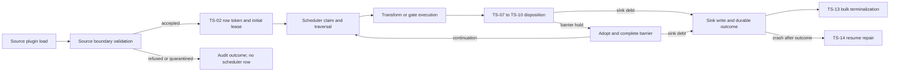

# Token Scheduler State Engine Discovery Findings

## System boundary

The scheduler is not only the `token_work_items` table. Its correctness spans
five coupled surfaces:

| Surface | Primary locations | Responsibility |
| --- | --- | --- |
| State vocabulary and schema | `src/elspeth/contracts/scheduler.py`, `src/elspeth/core/landscape/schema.py` | Define statuses, identities, ownership, subtype fields, and database constraints. |
| Scheduler repositories | `src/elspeth/core/landscape/scheduler/` | Perform queue, lease, disposition, barrier, event, branch-loss, and read-model operations. |
| Runtime orchestration | `src/elspeth/engine/` | Convert plugin results and recovery conditions into scheduler operations. |
| Plugin boundaries | Source, transform, gate, aggregation/coalesce, and sink executors | Separate external or plugin-visible effects from internal durable state. |
| Run authority and evidence | Run lifecycle/coordination repositories, events, token outcomes, tests | Fence writers, prevent premature finalization, and explain transitions. |

`TokenSchedulerRepository` is a compatibility facade. The authoritative
implementations live under `src/elspeth/core/landscape/scheduler/`.

## Authoritative repository split

| Responsibility | Implementation |
| --- | --- |
| Queue intake and fenced source ingest | `queue.py` — `SchedulerQueueRepository` |
| Claims, heartbeat, and expired-lease recovery | `leases.py` — `SchedulerLeaseRepository` |
| Claimed dispositions and sink terminalization | `dispositions.py` — `SchedulerDispositionRepository` |
| Barrier completion, release, and adoption | `barrier.py` — `BarrierJournalRepository` |
| Coalesce branch-loss replay cursor | `branch_losses.py` — `CoalesceBranchLossRepository` |
| Scheduler transition journal | `events.py` — `SchedulerEventStore` |
| Quiescence and active-work decisions | `read_model.py` — `SchedulerReadModel` |
| Identity, insertion, reconciliation, hydration | `work_items.py` |

No production module outside the scheduler package was found writing
`token_work_items`. Run lifecycle and coordination repositories read scheduler
state to gate finalization, worker departure, eviction, and lease recovery.

## Operational state is status plus subtype

The status enum alone does not define legal behavior.

| Status | Operational distinctions that affect legal transitions |
| --- | --- |
| `READY` | Normal continuation or fresh barrier emission. |
| `LEASED` | Transform lease when `pending_sink_name IS NULL`; sink-redrive lease when it is non-NULL. |
| `BLOCKED` | Barrier hold when `barrier_key IS NOT NULL`; dormant queue-only hold when only `queue_key` is present. |
| `PENDING_SINK` | Attributed park with an owner; recovered park with no owner; both require a complete sink bundle. |
| `TERMINAL` | Final scheduler obligation with scrubbed payload. |
| `FAILED` | Final failed scheduler obligation with scrubbed payload. |

Wave 1 positively reproduced two places where repository predicates fail to
enforce this subtype model: normal dispositions accept a sink-redrive lease, and
pending-sink claim accepts a malformed parked row without a sink name.

## Transaction shape

- Scheduler writes request SQLite write intent and use `BEGIN IMMEDIATE`.
- Fenced verbs verify/extend the leader seat on the same connection before
  scheduler payload mutation.
- A transition and its scheduler event normally share one transaction.
- Plugin calls do not run while a scheduler write transaction remains open.
- Branch-loss evidence commits with the disposition or barrier completion that
  consumes it.
- Sink node state, artifact, and terminal outcome precede scheduler sink
  terminalization. The terminal outcome is the repair witness after a crash.

The dangerous residuals are therefore primarily subtype holes, implicit
unfenced compatibility arms, and cross-transaction crash seams rather than a
single monolithic transaction bug.

## Production choreography

### Sink correction discovered in Wave 2

The singleton methods associated with TS-11 and TS-12 have no normal runtime
caller. Production closes both row-level edges through TS-13:

`LeaderDrainCoordinator` → `SinkFlushCoordinator` → `SinkExecutor` → scheduler
terminalization callback → `RowProcessor.mark_sink_bound_scheduler_terminal_many`
→ `mark_pending_sink_terminal_many`.

TS-11 and TS-12 remain useful transition identities, but the production entry
for proving them is the TS-13 bulk path.

## Read models are control decisions

Read methods do not mutate scheduler rows, but their truth tables authorize EOF
barrier flush, continuation relinquishment, resume, and run finalization.

| ID | Decision | Included | Excluded |
| --- | --- | --- | --- |
| RM-01 | Unresolved producer work | READY, BLOCKED, transform LEASED | PENDING_SINK, sink-redrive LEASED, final states |
| RM-02 | Work able to create new barrier arrivals | READY, transform LEASED | BLOCKED, both pending-sink forms, final states |
| RM-03 | Active run backstop | READY, LEASED, BLOCKED, PENDING_SINK | TERMINAL, FAILED |
| RM-04 | Peer-owned work | Other-owner LEASED or attributed PENDING_SINK | Caller-owned, ownerless, other statuses |
| RM-05 | Continuation relinquishment | No pending READY or FAILED IDs and RM-04 true | Still-READY, FAILED, or solo/self-owned work |
| RM-06 | Active peer leases | Other-owner LEASED with expiry strictly after `now` | Expired/equal, caller-owned, non-LEASED |

RM-01 has a strong production-verb matrix. RM-02–RM-06 have incomplete focused
truth-table or consumer evidence, making the read-model package the safest first
Wave 2 test slice.

## Discovery limitations

- The structural index was one documentation-only commit behind the repository
  baseline. Live Git diff showed no indexed source or test drift, so the source
  graph remained applicable.
- Wave 2 was read-only reconnaissance. It did not inject the missing crashes or
  create the new truth-table tests.
- Current tests provide strong repository kernels but do not automatically prove
  production plugin choreography, process contention, or every rollback image.
- Existing user changes under `docs/architecture/dag/` and `docs/README.md` are
  outside this assessment and remain untouched.
