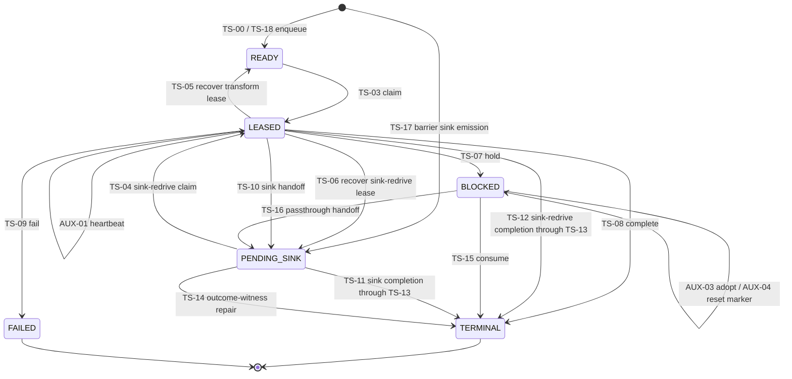

# Token Scheduler State Engine Map

## Purpose and authority

This document is the assessment-level overview of the token scheduler. The
exhaustive transition ledger remains the committed
[Token Scheduler State Engine Map](../../../token-scheduler-state-engine.md).
Where this assessment records a later production-call correction or evidence
classification, the dated assessment is authoritative for its baseline.

## Canonical lifecycle

`TS-01` composes enqueue and claim. `TS-02` additionally inserts the source row
and token under the leader fence. `TS-13` is the production bulk form that
realizes TS-11 and TS-12 after sink durability.

## Transition families

| Family | IDs | Production responsibility |
| --- | --- | --- |
| Intake and identity | TS-00–TS-03 | Deterministic work creation, source composition, replay, and READY claim. |
| Leasing and recovery | TS-04–TS-06, AUX-01/02 | Sink-redrive claim, heartbeat, lease loss, subtype-specific recovery, and identity rotation. |
| Claimed dispositions | TS-07–TS-10 | Hold, terminal, failed, and durable sink-handoff consequences. |
| Sink close and repair | TS-11–TS-14 | Outcome-ordered bulk terminalization and resume repair. |
| Barrier adoption/completion | TS-15–TS-18, AUX-03–05 | Exhaustive consume/emit, membership adoption, marker reset, and branch-loss replay. |
| Worker/run authority | AUX-06/07 | Membership and leader-epoch gates. |
| Orchestration reads | RM-01–RM-06 | Flush, relinquish, resume, and finalization decisions. |
| Plugin boundary | PB-01–PB-09 | Source through sink lifecycle and follower execution. |
| Forbidden paths | F-01–F-13 | Illegal transitions, stale authority, dormant holds, and deliberately absent state. |

## Durable identity and evidence rules

- `(run_id, token_id, node_id, attempt)` is unique; terminal-lane identities
  receive a separate partial unique index when `node_id IS NULL`.
- Transform recovery increments attempt and rotates `work_item_id`.
- Sink-redrive recovery preserves attempt, work identity, payload, and sink
  bundle so the same durable handoff can resume.
- Successful status changes append scheduler events in the same transaction.
- Scheduler events form a transition journal, not a journal of every state-engine
  mutation. Successful heartbeat, barrier adoption/reset, and branch-loss
  adoption currently emit no scheduler event.
- Token outcomes and scheduler status are separate axes. A completed outcome is
  the durable witness that lets TS-14 close a parked sink handoff without
  repeating sink I/O.

## Fencing model

Protected mutations should verify the active `(run_id, leader_worker_id,
leader_epoch)` before changing scheduler payload. Claims and claimed-item
dispositions also enforce active worker membership where their public entry
accepts a worker identity.

The current implementation has explicit compatibility arms that violate a
simple fail-closed rule:

- `fenced_or_plain_write(..., coordination_token=None)` selects a plain write;
- legacy barrier release wrappers depend on the unfenced arm;
- standalone initial enqueue-and-claim can reach an internal claim helper
  without the normal membership guard;
- TS-14 repair also passes explicit `None` through the common helper in one
  production-visible path.

These are implementation findings with existing tracker ownership, not accepted
architecture.

## Cross-transaction seams

| Durable step A | Later step B | Required restart question |
| --- | --- | --- |
| TS-02 initial lease | Source node state becomes COMPLETED | Can resume reconcile without losing or duplicating the source row? |
| Child TS-00 enqueue(s) | Parent TS-08/09/10 disposition | Can replay avoid duplicate children and a stranded parent? |
| Transform/plugin return | Terminal node-state audit | Can a replayed plugin effect be made safe or explicitly bounded? |
| Aggregation batch/outcome completion | TS-15 barrier completion | Can successful transform-mode aggregation resume exactly once? |
| Aggregation TS-15 completion | Later non-sink child TS-00 | Can restart recover the missing continuation? |
| Coalesce decision/audit | TS-15/17/18 completion | Can restart reuse the durable merge without a duplicate? |
| Sink external flush | Durable outcome witness | What duplication window is declared for non-idempotent I/O? |
| Durable sink outcome | TS-13 terminalization | Does TS-14 repair prevent re-emission and append one terminal event? |

## Current evidence posture

- Wave 1 confirmed TS-03, TS-05, and F-07.
- Every other Wave 1 leg is a confirmed Gap under the full proof standard, even
  where substantial positive evidence exists.
- Wave 2 repository kernels are strong, but no Wave 2 package as a whole yet
  satisfies every success, refusal, rollback, production-boundary, and
  concurrency requirement.
- The first bounded improvement is the RM-02–RM-06 truth-table package described
  in the [remediation plan](05-remediation-plan.md).
