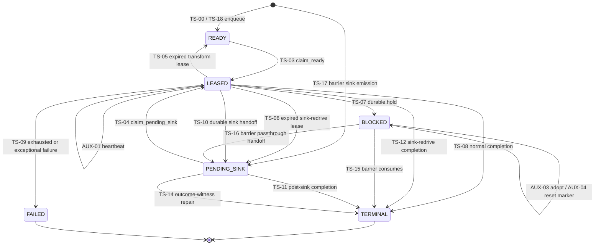

# Token Scheduler State Engine Map

| Map property | Value |
|---|---|
| Scope | Durable token scheduler, from source-plugin ingress through transform, gate, barrier, and sink-plugin boundaries. |
| Excluded | The web session engine. |
| Mapped against | Commit `8c5e9533c80c00bfc3b401c1c394e8308815ce1e` (release `0.7.1`). |
| Evidence state | Implementation mapped; test candidates located; positive per-leg confirmation has not yet been performed. |

This is the canonical working map for the token scheduler's test-verification
campaign. It describes what the current code does. It does not replace an ADR,
declare old ADRs superseded, or infer guarantees from test names.

## How to read and update this map

Every durable transition has a stable `TS-*` identifier. State-preserving and
adjacent compare-and-swap operations use `AUX-*`; plugin and orchestrator
boundary paths use `PB-*`; read-model predicates use `RM-*`; forbidden or
refused paths use `F-*`.

The evidence labels mean:

- **Mapped:** the production implementation and its callers were inspected.
- **Candidate:** a test appears relevant, but has not yet passed the proof bar.
- **Confirmed:** reserved for a later verification pass that executes the real
  production method, asserts the state change and required side effects, and
  proves the relevant refusal/rollback behavior.
- **Gap:** reserved for a confirmed missing or inadequate proof. Only confirmed
  gaps should be promoted into Filigree issues.

For concurrency claims, a `Confirmed` result requires a real two-connection or
multi-process test. A mock-only test cannot confirm a race guarantee.

## Authoritative surfaces

`TokenSchedulerRepository` is a compatibility facade. The current behavior is
implemented by components under `src/elspeth/core/landscape/scheduler/`:

| Responsibility | Authoritative implementation |
|---|---|
| Queue intake and fenced source ingest | `queue.py` — `SchedulerQueueRepository` |
| Claims, heartbeat, and expired-lease recovery | `leases.py` — `SchedulerLeaseRepository` |
| Claimed-item dispositions and sink terminalization | `dispositions.py` — `SchedulerDispositionRepository` |
| Barrier completion, release, and adoption | `barrier.py` — `BarrierJournalRepository` |
| Coalesce branch-loss ledger | `branch_losses.py` — `CoalesceBranchLossRepository` |
| Scheduler transition journal | `events.py` — `SchedulerEventStore` |
| Quiescence and active-work reads | `read_model.py` — `SchedulerReadModel` |
| Identity, insert reconciliation, and hydration | `work_items.py` |
| Historical public surface | `src/elspeth/core/landscape/scheduler_repository.py` — `TokenSchedulerRepository` |

No production module outside that scheduler package writes
`token_work_items`. The run-lifecycle and coordination repositories read it to
enforce run finalization and worker-eviction gates.

## State vocabulary and operational subtypes

The enum is `TokenWorkStatus` in `src/elspeth/contracts/scheduler.py`.

| State | Durable meaning | Operational subtype that matters |
|---|---|---|
| `READY` | A continuation may be claimed once `available_at` is reached. | Normal DAG continuation or fresh barrier emission. |
| `LEASED` | Exactly one worker is entitled to dispose the row under the owner CAS. | **Transform lease:** `pending_sink_name IS NULL`; recovery returns it to `READY` with a new attempt. **Sink-redrive lease:** `pending_sink_name IS NOT NULL`; recovery returns it to `PENDING_SINK` without changing identity. |
| `BLOCKED` | The lease is released while an external release condition is pending. | **Barrier hold:** `barrier_key IS NOT NULL`; aggregation/coalesce intake and release can see it, even if `queue_key` is also set. **Queue-only hold:** `barrier_key IS NULL` and `queue_key IS NOT NULL`; barrier sweeps deliberately exclude it. No production release path for queue-only holds was located in this pass. |
| `PENDING_SINK` | Producer work is durable; external sink durability is still owed. | **Attributed park:** `lease_owner` identifies the worker allowed to terminalize after the sink write. **Recovered park:** owner is `NULL` and must be reclaimed before normal terminalization. |
| `TERMINAL` | Scheduler obligations are complete. | Final; payload is scrubbed. |
| `FAILED` | Claimed processing failed and the run failure path owns the consequence. | Final; payload is scrubbed. |

`WAITING` is not a state. It and its maintenance path were deleted after being
found unreachable. The scheduler event journal still records immutable history
for rotated work-item identities.

## Canonical lifecycle

`TS-01` is the atomic composition `absent → READY → LEASED`. When its
deterministic row already exists as an exact `READY` replay, it reconciles the
insert and performs only the claim, degenerating to TS-03 without a second
`ENQUEUE` event. `TS-02` additionally composes the source `rows` and `tokens`
inserts under the leader epoch fence. `TS-13` is the fail-closed bulk form of
`TS-11`/`TS-12`.

## Durable transition ledger

Every evidence entry below is **Candidate**, not yet **Confirmed**.

| ID | Edge | Production trigger and guard | Required atomic consequences | Scheduler event | Candidate evidence |
|---|---|---|---|---|---|
| TS-00 | absent → `READY` | `SchedulerQueueRepository.enqueue_ready`; reference validation, deterministic identity, optional active-worker fence | Insert complete resume cursor; exact replay is idempotent; incompatible replay fails | `ENQUEUE` (`None→READY`) | `test_scheduler_events.py::test_enqueue_ready_records_single_idempotent_scheduler_event`; lifecycle property rules `enqueue` and `reenqueue_is_idempotent` |
| TS-01 | absent → `READY` → `LEASED`; exact existing `READY` → `LEASED` | `enqueue_ready_claimed` / `enqueue_ready_claimed_on`; reconcile insert then claim CAS on one connection | A new work row plus both transitions commit or roll back together. An exact existing row receives only the claim mutation. | New row: `ENQUEUE`, `CLAIM_READY`; existing row: `CLAIM_READY` only | `test_scheduler_events.py::test_enqueue_ready_claimed_records_enqueue_and_claim_events_in_one_operation`; post-coalesce reconciliation candidates |
| TS-02 | absent row/token → `READY` → `LEASED` | `ingest_row_with_initial_claim`; required leader identity and epoch fence is first statement | `rows`, `tokens`, work item, claim, and both events share one fenced `BEGIN IMMEDIATE` transaction | Same as TS-01; coordination plane records fence refusal | `test_leader_fence_stale_token.py::test_ingest_woken_mid_ingest_atomic_rollback`; `test_suspended_winner_fences.py::test_stale_ingest_rolls_back_atomically_no_orphan_rows_row` |
| TS-03 | `READY` → `LEASED` | `claim_ready`; run/status/availability CAS, deterministic order, membership fence. TS-01's reconciliation arm reaches the same row helper without that membership fence. | Set owner and expiry without changing attempt or identity | `CLAIM_READY` | lifecycle property rule `claim_ready`; `test_scheduler_events.py::test_claim_and_terminal_events_record_status_and_lease_ownership`; direct-repository N=0 claim hammers in `test_two_process_scheduler_contention.py` |
| TS-04 | `PENDING_SINK` → `LEASED` | `claim_pending_sink`; run/status CAS plus membership fence | Preserve the pending-sink fields exactly as stored, plus attempt and identity; set new owner and expiry | `CLAIM_PENDING_SINK` | lifecycle property rule `claim_pending_sink`; `test_scheduler_events.py::test_pending_sink_claim_and_terminalization_record_transition_events`; absent-member refusal in `test_coordination_fence_constructs.py` |
| TS-05 | expired transform `LEASED` → `READY` | `recover_expired_leases`; expired, non-caller owner; fenced path additionally requires dead owner or stall-budget expiry | Clear lease, increment attempt, rotate deterministic `work_item_id`; optionally record `worker_stalled` | `RECOVER_EXPIRED_LEASE` with previous identity in context | lifecycle property rule `recover_expired_leases`; `test_scheduler_events.py::test_recover_expired_leases_records_attempt_bump_and_previous_work_item`; lease-recovery race suite |
| TS-06 | expired sink-redrive `LEASED` → `PENDING_SINK` | Same verb, selected by non-NULL `pending_sink_name` | Clear lease; preserve attempt, work-item identity, payload, and pending-sink fields exactly as stored | `RECOVER_EXPIRED_LEASE` | `test_expired_pending_sink_lease_recovers_in_place_preserving_attempt_and_work_item_id`; reclaim-attribution test in `test_leader_fence_stale_token.py` |
| TS-07 | `LEASED` → `BLOCKED` | `mark_blocked`; exact work item and owner CAS, optional membership fence, at least one release key | Clear lease; stamp keys and `barrier_blocked_at`; branch into barrier-hold or queue-hold subtype | `MARK_BLOCKED` | lifecycle property rule `mark_blocked`; `test_scheduler_events.py::test_mark_blocked_and_mark_failed_record_transition_events`; aggregation/follower production-path tests |
| TS-08 | transform `LEASED` → `TERMINAL` | `mark_terminal`; exact work item/status/owner CAS and optional membership fence | Clear lease, scrub payload; optional branch-loss row commits in same transaction | `MARK_TERMINAL` | lifecycle property rule `mark_terminal`; scheduler event test; scheduler drain terminal and follower terminal tests |
| TS-09 | transform `LEASED` → `FAILED` | `mark_failed`; same CAS discipline | Clear lease, scrub payload; optional branch-loss row commits in same transaction | `MARK_FAILED` | lifecycle property rule `mark_failed`; scheduler event test; `test_scheduler_drain_characterization.py::test_claimed_token_failure_marks_failed_with_fence` |
| TS-10 | transform `LEASED` → `PENDING_SINK` | `mark_pending_sink`; same CAS discipline | Replace payload with post-producer row, persist sink/outcome/path/error bundle, keep owner but clear expiry; optional branch loss | `MARK_PENDING_SINK` | lifecycle property rule `mark_pending_sink`; attributed-park tests; scheduler drain sink-bound test; follower sink-handoff E2E test |
| TS-11 | attributed `PENDING_SINK` → `TERMINAL` | `mark_pending_sink_terminal`; required leader fence, non-NULL `pending_sink_name`, and strict owner CAS | Caller contract requires sink outcome durability first; this verb does not query that witness. It scrubs every eligible token-scoped row and returns the count; it does not assert exactly one. | `MARK_PENDING_SINK_TERMINAL` per row | lifecycle property rule `mark_pending_sink_terminal`; strict-owner tests; processor sink callback test |
| TS-12 | sink-redrive `LEASED` → `TERMINAL` | Same method; accepts `LEASED` only with non-NULL `pending_sink_name` and matching owner | Same multi-row token-scoped behavior as TS-11 | Same, with `from_status=LEASED` | lifecycle property rule `mark_pending_sink_terminal`; recovered-handoff reclaim test |
| TS-13 | TS-11/TS-12 bulk | `mark_pending_sink_terminal_many`; required leader fence, unique requested IDs, exactly one eligible row and matching owner for every token | Validate the complete batch before mutation; all rows and per-row events commit or roll back together | One `MARK_PENDING_SINK_TERMINAL` per row | bulk scheduler event, duplicate, missing, wrong-owner, and NULL-owner tests |
| TS-14 | `PENDING_SINK` → `TERMINAL` repair | `terminalize_pending_sinks_with_terminal_outcomes`; required leader fence and completed `token_outcomes` witness; owner-blind by design | Terminalize only parked rows whose external outcome is already durable; never reclaim or re-emit the sink write | `MARK_PENDING_SINK_TERMINAL` | `test_pending_sink_with_terminal_outcome_is_repaired_without_reclaiming_sink`; processor resume repair test; stale-fence refusal test |
| TS-15 | `BLOCKED` → `TERMINAL` | `complete_barrier` / `_terminalize_consumed_barrier_rows`; exact run, barrier, status, and token set; strict arm is exhaustive over durable or intake-snapshot universe | Consume rows, scrub payloads, emit outputs, and record optional branch losses in one transaction. Token-carrying production calls are leader-fenced; explicit `coordination_token=None` reaches the unfenced compatibility arm. | `MARK_BLOCKED_BARRIER_TERMINAL` per consumed row | lifecycle property release rule; scheduler event test; `test_scheduler_repository_complete_barrier.py` atomicity/exhaustiveness family; barrier integration tests |
| TS-16 | `BLOCKED` → `PENDING_SINK` | `complete_barrier` / `_transition_passthrough_pending_sink`; exact barrier/work-item/token/status CAS | Replace payload and sink bundle; stamp attributed owner when supplied; no expiry | `MARK_PENDING_SINK` | lifecycle property handoff rule; scheduler event test; complete-barrier passthrough coverage test |
| TS-17 | absent → `PENDING_SINK` | Strict `complete_barrier` fresh terminal-lane emission; `node_id` must be NULL and the resume cursor complete | Insert sink bundle and optional attributed owner in the same transaction that consumes the barrier inputs | `MARK_PENDING_SINK` (`from_status=None`) | complete-barrier atomic and combined-lane tests; barrier-intake disposition integration suite |
| TS-18 | absent → `READY` | Strict `complete_barrier` continuation emission; complete cursor and reference validation | Insert continuation in the same transaction that consumes the barrier inputs | `ENQUEUE` (`from_status=None`) | complete-barrier ready-emission, combined-lane, and scoped coalesce-child tests |

## Status-preserving and adjacent state planes

These mutations are part of scheduler correctness even though they are not a
change to `TokenWorkStatus`.

| ID | Mutation | Contract | Event behavior | Candidate evidence |
|---|---|---|---|---|
| AUX-01 | `LEASED → LEASED` heartbeat | `heartbeat_lease` CASes work item, run, status, and owner; extends `lease_expires_at`. It can revive an expired lease only if no peer has reaped it. | No event on success. | heartbeat tests in `test_multi_source_foundation.py`; scheduler drain heartbeat characterization |
| AUX-02 | Heartbeat CAS miss | Scheduler row is not mutated by the loser. The worker records the observed loss and raises `SchedulerLeaseLostError`, causing the drain to abandon its in-flight result and disposition. | `LEASE_LOST` observation event. | two scheduler event tests plus `test_lease_lost_mid_processing_abandons_result_and_writes_no_disposition` |
| AUX-03 | Barrier adoption marker `NULL → leader_epoch` | `adopt_blocked_barrier_item` requires leader fence and exact BLOCKED-row CAS. Aggregation adoption also inserts `batch_members` and a backdated BUFFERED `token_outcomes` row atomically. | No scheduler event. | lifecycle adoption rules; `test_scheduler_repository_adopt_barrier_item.py` |
| AUX-04 | Coalesce adoption marker `epoch → NULL` | `reset_adoption_marker_to_pending` repairs adopted-but-holdless, incomplete coalesce rows before executor restore; only BLOCKED rows are reset. Aggregation adoption restores from durable membership/BUFFERED evidence instead. | No scheduler event. | barrier-intake restore test; processor adopted-holdless restore test |
| AUX-05 | Branch-loss replay cursor `NULL → leader_epoch` | `adopt_coalesce_branch_losses` is leader-fenced and idempotent. Loss creation itself rides the lossy disposition or barrier completion transaction. | Separate branch-loss ledger; no scheduler event. | branch-loss repository tests; follower lossy-branch E2E and barrier-intake replay tests |
| AUX-06 | Worker membership gate | Public `claim_*`, ordinary `enqueue_ready` calls carrying a worker identity, and claimed-item dispositions use `run_workers` membership fences. TS-01's internal claim is not membership-fenced unless an outer transaction supplies the stronger guard. Active workers pass; departed/evicted workers are refused. | Coordination events, not scheduler events. | coordination-fence construct tests; follower eviction tests; suspended-winner E2E tests |
| AUX-07 | Leader epoch gate | Token-carrying arms of fenced ingest, recovery, barrier completion/adoption, branch-loss adoption, sink terminalization, and repair first verify and extend `(run_id, leader_worker_id, leader_epoch)`. Recovery and legacy barrier wrappers also retain unfenced compatibility arms. | Fence extension/refusal is in the coordination event plane. | stale-token unit suite and suspended-winner E2E suite |

The `scheduler_events` table is therefore a status-transition journal, not a
complete journal of every scheduler-related mutation.

## Plugin and orchestrator boundary paths

```mermaid
flowchart LR
    SRC[SourceProtocol.load] -->|valid SourceRow| ROW[RowProcessor.process_row]
    SRC -->|quarantined SourceRow| QUAR[Quarantine router and sink; no scheduler row]
    ROW -->|boundary accepted| INGEST[TS-02 fenced row + token + initial claim]
    ROW -->|boundary refused| NOSCHED[Audit failure; no scheduler row]
    INGEST --> DRAIN[SchedulerDrainCoordinator]
    DRAIN --> TRAV[TokenTraversalEngine]
    TRAV --> TRANSFORM[TransformProtocol.process]
    TRAV --> GATE[GateExecutor expression]
    TRANSFORM --> DISP{Result disposition}
    GATE --> DISP
    DISP -->|continue/fork/expand| READY[TS-00 child READY]
    DISP -->|complete without sink debt| TERM[TS-08 TERMINAL]
    DISP -->|failure| FAIL[TS-09 FAILED]
    DISP -->|sink-bound| PS[TS-10 PENDING_SINK]
    DISP -->|aggregation/coalesce hold| BLOCK[TS-07 BLOCKED]
    BLOCK --> INTAKE[Leader barrier intake AUX-03]
    INTAKE --> BATCH[Batch TransformProtocol.process or in-engine coalesce]
    BATCH --> COMPLETE[TS-15/16/17/18 complete_barrier]
    PS --> SINK[SinkProtocol.write + flush]
    COMPLETE -->|TS-16 or TS-17 sink emission| SINK
    COMPLETE -->|TS-18 READY continuation| DRAIN
    COMPLETE -->|aggregation child TS-00, later transaction| READY
    COMPLETE -->|TS-15 consume only| RELEASED[No emitted scheduler work]
    SINK -->|durable node state, artifact, token outcome| CLOSE[TS-11/12/13]
    SINK -->|crash after outcome, before close| REPAIR[TS-14 resume repair]
```

Plugin ordering depends on the boundary: source loading precedes scheduling;
row transforms run after a claim commits and before its disposition; sink I/O
runs after TS-10/16/17 creates durable sink debt and before TS-11/13 clears it.
The engine holds no scheduler write transaction across source, transform, or
sink plugin I/O.

| ID | Boundary | Production choreography | Scheduler consequence | Candidate production-path evidence |
|---|---|---|---|---|
| PB-01 | Source plugin ingress | `SourceIterationCoordinator.load_source_with_events` calls `SourceProtocol.load`; `run_main_processing_loop` passes each valid `SourceRow` and the source plugin to `RowProcessor.process_row`. Quarantined source rows branch earlier to the quarantine router and sink. Source declaration/contract checks run before happy-path scheduling. | Accepted row uses TS-02. A yielded-row boundary failure records row/token failure evidence but creates no scheduler row. A load/iterator exception before a row exists has no row, token, or scheduler record. Source quarantine bypasses scheduler state. | processor source-boundary tests; source load/iteration failure tests; stale-ingest E2E; concurrent pumping and quarantine integration tests |
| PB-02 | Row transform plugin | `TokenTraversalEngine.handle_transform_node` reaches `TransformExecutor.execute_transform`, which opens node state, validates boundaries, calls `TransformProtocol.process`, and terminally closes the node state. | Continue/fork/expand children use TS-00; sink-bound results use TS-10; normal terminal/failure paths use TS-08/09. | processor durable-scheduler result tests and transform executor tests |
| PB-03 | Declarative gate | `TokenTraversalEngine.handle_gate_node` reaches `GateExecutor.execute_config_gate`. This evaluates configuration; it is not an arbitrary plugin call. | Continue/fork children use TS-00. Discard, routed sink, and failure dispositions become TS-08/10/09; coalesce branch loss rides the same disposition. | gate routing, discard, fork, and branch-loss processor tests |
| PB-04 | Aggregation barrier | A claimed token reaches a batch-aware transform. Leader and follower paths deposit TS-07 before leader journal intake. `BarrierIntakeCoordinator` opens batch membership, performs AUX-03, feeds adopted rows to `AggregationExecutor`, and triggers the batch plugin. | Successful sink-bound output uses atomic TS-15+TS-16/17. Non-sink continuation children are enqueued later as TS-00, not TS-18. A returned plugin error writes terminal failure outcomes then performs separate TS-15-only release; a raised plugin exception leaves rows BLOCKED for restore/retry. | scheduler intake slice tests; aggregation buffering/flush tests; `test_aggregation_recovery.py::test_failed_flush_crash_between_terminal_write_and_release_resumes` |
| PB-05 | Coalesce barrier | Fork siblings deposit TS-07 under the coalesce key. Leader intake adopts the rows and replays durable branch losses; `CoalesceExecutor` resolves merge/failure/timeouts in engine code. | A successful terminal merge uses TS-15+TS-17; a successful nonterminal merge uses TS-15+TS-18. Group failures and late-arrival release are TS-15-only. Rows outside the firing snapshot remain BLOCKED for later intake/release. | coalesce processor tests; barrier-intake dispositions; complete-barrier scoped/snapshot tests |
| PB-06 | Sink plugin | `SinkFlushCoordinator` groups pending tokens and calls `SinkExecutor.write`. The executor opens states, validates the boundary, invokes `SinkProtocol.write`, and flushes. For the primary non-diverted path, node states, artifact, and outcomes then commit in one audit transaction. Failsink diversion performs secondary I/O and persists per-token state/routing, artifact, and outcomes across separate commits; discard has its own per-token durability path. | Only tokens marked `scheduler_pending_sink` invoke TS-13 after the selected primary/diversion/discard evidence is durable. Failure before that evidence leaves sink debt open; failure after external I/O but before evidence can repeat I/O. | mocked-`SinkExecutor` callback-selection tests; real sink durability tests without scheduler close; sink diversion unit tests |
| PB-07 | Post-sink crash repair | Sink durability and token outcome can commit before the scheduler callback. Resume drains run the outcome-witness repair before reclaiming pending sinks. | TS-14 closes the handoff without repeating external I/O. | scheduler event repair test; processor `test_pending_sink_resume_repairs_already_outcomed_row_without_reemitting_sink` |
| PB-08 | Follower worker | A follower claims READY work and executes row-level transforms/gates, but does not evaluate aggregation triggers or write sinks. It deposits barrier holds or owner-attributed sink handoffs for the leader. | TS-03 followed by TS-07, TS-08, TS-09, or TS-10. The leader later owns intake, sink write, and finalization. | follower processor tests with mocked traversal boundaries; `test_follower_join_and_drain.py` direct-repository disposition cases, not full plugin traversal |
| PB-09 | Plugin lifecycle | Fresh leaders call `on_start` for sources, transforms, then sinks before source iteration. Resume starts transforms and sinks but deliberately skips the source. The CLI follower likewise starts and tears down transforms/sinks only. Cleanup calls `on_complete` then `close` for every successfully started plugin, including error paths. | Lifecycle hooks do not themselves move scheduler state; startup must precede any PB-01/02/06 call, and teardown follows the run/follower drain ceremony. | orchestrator lifecycle/cleanup tests, resume characterization, CLI follower startup failure, and follower teardown tests |

### Alternate entry paths

The main source path enters through the leader-fenced TS-02 composition, but
alternate paths matter to the state-engine contract:

- Ordinary fork/expand/continue children use TS-00, then a later TS-03 claim.
- Whole-row resume (`process_existing_row`) and mid-pipeline replay
  (`process_token`) call `_drain_durable_work_queue` without a preclaimed item.
  Its first enqueue uses `claim_immediately=True`, reaching standalone TS-01.
- Post-coalesce traversal is different: leader-fenced `complete_barrier` has
  already inserted TS-18 `READY`. The same standalone helper reconciles that
  deterministic row and applies only the claim arm, with no second `ENQUEUE`.
- All three call chains above reach `claim_ready_row` with
  `membership_fenced=False` and do not themselves open the TS-02 leader
  transaction. The implementation comment says an outer fence protects
  internal callers. Whether a higher orchestration invariant makes these
  standalone uses safe is a candidate gap for the fencing work package; it is
  not assumed here.
- Uncoordinated `process_row` is a legacy fallback: it writes row/token,
  source COMPLETED state, and standalone TS-01 in separate transactions.
- Source quarantine and some terminal post-coalesce resume outcomes complete
  in the audit/outcome plane without creating scheduler work. Those bypasses
  are deliberate only if the associated token is already terminal and carries
  no unquiesced scheduler obligation.

### Cross-transaction crash seams

These boundaries cannot be described as one atomic state transition. The test
campaign and replacement ADR must state which durable side is authoritative
after a process death between the two commits.

| Earlier durable action | Later durable action | Recovery or replay authority |
|---|---|---|
| Source yields and boundary accepts a row | TS-02 ingest | Before TS-02 there is no row/token/scheduler witness; restart relies on source/checkpoint replay policy. |
| TS-02 row/token/initial-claim commit | Source COMPLETED node state, then traversal | The scheduler lease is durable, but reconstruction of a missing source state at this exact crash point requires positive confirmation. |
| Whole-row resume token creation | Source COMPLETED state, then standalone TS-01 | These are three transactions; the recovery authority for a token stranded between them requires positive confirmation. |
| Transform plugin returns or performs external effects | Terminal transform node state/audit | Hard death can leave an OPEN state and recoverable scheduler lease; replay may invoke the plugin again. |
| Transform/gate audit result | TS-07/08/09/10 claimed-item disposition | The scheduler lease remains the replay authority until disposition commits. |
| Child TS-00 enqueue(s) | Parent TS-08/09/10 disposition | A repeated insert is idempotent only for the same already-minted child identity. Fork/expand replay can mint new child IDs while the parent outcome is already durable, so parent-lease recovery alone does not prove end-to-end replay safety. |
| Aggregation DRAFT batch membership | AUX-03 adoption | A crash can leave an orphan DRAFT batch before the fenced adoption; reconciliation requires positive confirmation. |
| AUX-03 barrier adoption | Executor in-memory batch/coalesce restore | Aggregation restores from batch membership plus BUFFERED outcome. AUX-04 is only the coalesce adopted-but-holdless reset; completed-key late arrivals use TS-15 release. |
| Aggregation batch/node-state/outcome commit | TS-15+TS-16/17 successful barrier completion | BLOCKED inputs remain durable, but transform-mode terminal outcomes can make the normal BUFFERED restore arm unavailable; this residual seam requires explicit recovery proof. |
| Aggregation terminal failure outcomes | TS-15-only failed-flush release | Restore reconciles completed failed flushes; the existing crash/reconcile test is candidate evidence. |
| Aggregation TS-15 completion | Non-sink child TS-00 enqueue(s) | Barrier inputs are already TERMINAL before continuations are scheduled; recovery of a crash in this interval requires positive confirmation. |
| Coalesce decision/audit records | TS-15/17/18 `complete_barrier` | Barrier rows remain BLOCKED until exhaustive completion commits. |
| In-memory branch-loss notification | Branch-loss row riding a later disposition/completion | Durable scheduler state and the branch-loss ledger, not memory, govern replay after restart. |
| External `sink.write` and `flush` | Durable sink node states, artifact, and terminal outcomes | Before the audit transaction commits there is no internal witness; process death or deposition can repeat external I/O. Sink idempotency or an external transaction protocol must carry this seam. |
| Sink node state, artifact, and terminal outcome | TS-11/12/13 scheduler terminalization | The terminal outcome is the witness for TS-14; external sink I/O must not repeat. |

## Orchestration ordering and quiescence

`SchedulerDrainCoordinator.drain_claims` owns the production order:

1. On resume, recover expired leases, repair already-outcomed pending sinks,
   then claim and reconstruct remaining pending sinks without rerunning their
   producer.
2. Before every READY claim, run journal-first barrier intake and enqueue any
   continuations already made durable by barrier completion.
3. Claim one item and retain its exact owner as the disposition CAS witness.
4. Heartbeat between traversal nodes. A later heartbeat that detects lease
   loss abandons the in-flight result and performs no disposition. There is no
   item heartbeat during one plugin call or after a final-node call before
   disposition; if the stall budget reaps that lease, the stale work-item or
   owner CAS fails at disposition instead.
5. Persist child continuations before disposing the parent claim.
6. Convert the claimed result into exactly one of TS-07/08/09/10.
7. A buffered result always forces another intake iteration before the drain
   may exit.

Followers run no scheduler maintenance. The leader evicts dead members before
reaping their expired leases. Registered workers may relinquish in-memory
continuations only when none remain READY, none are FAILED, and durable rows
show that a peer owns the work.

Leader finalization first waits a bounded period for peer leases while reaping
dead peers, then refuses unresolved producer work. It flushes the leader's sink
debt, repeatedly drains and flushes late follower `PENDING_SINK` work until no
peer lease or scheduled work remains (also bounded), and finally relies on the
run-completion active-work CAS as the fail-closed backstop.

Run success is guarded independently: `RunLifecycleRepository.complete_run`
refuses to stamp a successful terminal run while any `READY`, `LEASED`,
`BLOCKED`, or `PENDING_SINK` row exists. `SchedulerReadModel` provides narrower
unquiesced and unresolved predicates for the barrier and sink phases.

## Read-model truth table

These predicates do not mutate state, but they decide whether orchestration may
flush, resume, relinquish, or finalize.

| ID | Predicate or decision | Rows that count | Rows deliberately excluded |
|---|---|---|---|
| RM-01 | Unresolved producer work | `READY`, `BLOCKED`, and transform `LEASED` where `pending_sink_name IS NULL` | `PENDING_SINK`, sink-redrive `LEASED`, `TERMINAL`, `FAILED` |
| RM-02 | Unquiesced work that can create a new barrier arrival | `READY` and transform `LEASED` where `pending_sink_name IS NULL` | `BLOCKED`, `PENDING_SINK`, sink-redrive `LEASED`, final states |
| RM-03 | Active work / run-success backstop | `READY`, `LEASED`, `BLOCKED`, `PENDING_SINK` | `TERMINAL`, `FAILED` |
| RM-04 | Peer-owned work discriminator | Other-owner `LEASED` or attributed `PENDING_SINK` | Caller-owned rows, ownerless rows, and all other statuses |
| RM-05 | In-memory continuation relinquish | Every pending ID must have READY count zero and FAILED count zero, and RM-04 must be true for the run | Any still-READY or FAILED pending ID; solo/self-owned work |
| RM-06 | Active peer leases at resume guard | Other-owner `LEASED` with `lease_expires_at > now` | Expired leases, caller-owned leases, and non-LEASED states |

## Forbidden, refused, and deliberately absent legs

| ID | Refused or absent path | Current enforcement | Candidate evidence |
|---|---|---|---|
| F-01 | `READY → TERMINAL` without a claim | Disposition CAS accepts only `LEASED`. | lifecycle rule `ready_cannot_jump_to_terminal` and terminal-event invariant |
| F-02 | Any transition out of `TERMINAL` or `FAILED` | No repository verb accepts either final status as a source. | lifecycle rule `final_states_are_final` |
| F-03 | BLOCKED release through a different barrier | Barrier key is part of every release predicate; mismatch fails with zero commit. | lifecycle rule `blocked_is_immune_to_foreign_barrier` |
| F-04 | Claimed disposition by the wrong owner | Exact `lease_owner` CAS; registered evicted/departed workers also fail membership fence. | negative repository tests and coordination-fence tests |
| F-05 | `LEASED → BLOCKED` without a queue or barrier key | `mark_blocked` rejects before opening the transition. | missing-key repository and scheduler-drain invariant tests |
| F-06 | Claim by an absent or inactive registered worker | Claim membership fence permits N=0 test mode, but refuses absent callers once workers exist and raises for departed/evicted callers. | coordination-fence and suspended-winner tests |
| F-07 | Recovery of the caller's own or not-yet-expired lease; on the fenced arm, a registry-live non-stalled lease | Symmetric selection/update predicates exclude it. The unfenced compatibility arm does not consult worker liveness and may reap any expired non-caller lease. | lifecycle recovery rule; lease sweep and race tests |
| F-08 | Partial or wrong-owner sink batch terminalization | Bulk method validates all requested identities and owners before mutation. | duplicate, missing, NULL-owner, and wrong-owner batch tests |
| F-09 | Non-exhaustive strict barrier completion | Strict completion rejects duplicates, overlap, missing/foreign rows, uncovered rows, cross-group snapshots, and incomplete output cursors. | complete-barrier negative family |
| F-10 | Stale mutation through required leader-fenced verbs | Those verbs refuse the old identity/epoch before scheduler payload writes. Standalone TS-01 and documented compatibility arms are outside this claim. | stale-token unit suite and suspended-winner E2E suite |
| F-11 | Source boundary failure entering the queue | Boundary failure records audit evidence and deliberately creates no scheduler row. | processor source-boundary tests |
| F-12 | `WAITING` state or release | State and verbs are deleted. | lifecycle state-machine vocabulary and source search |
| F-13 | General queue-hold release | No production release verb was located for BLOCKED rows carrying only `queue_key`. The current traversal appears not to produce this subtype. Treat it as dormant/unconfirmed, not as a working lifecycle edge. | No positive candidate located; reachability must be settled in the verification campaign. |

## Transaction, identity, and schema invariants

- Scheduler writes declare write intent and use SQLite `BEGIN IMMEDIATE`.
- Fenced verbs verify and extend the leader seat on the same connection before
  scheduler payload mutation.
- State mutation and its `scheduler_events` insert use the same transaction.
  If the event insert fails, the state mutation must roll back.
- Branch loss is staged before the in-memory notification, but the durable
  branch-loss row is written later with the lossy disposition or barrier
  completion transaction.
- Work-item identity is deterministic. Normal lease recovery advances attempt
  and rotates identity; sink-redrive recovery preserves both.
- `(run_id, token_id, node_id, attempt)` is unique. A separate partial unique
  index protects terminal-lane identities where `node_id IS NULL`.
- Token, row, node, and coalesce-node references are run-scoped composite
  foreign keys.
- The schema enforces a non-empty owner for `status='leased'`.
- Scheduler-event type, from/to status, and non-negative attempts are CHECK
  constrained. `scheduler_events.work_item_id` intentionally is not a foreign
  key because recovery rotates the live identity while history remains immutable.
- Barrier holds are mechanically selected by
  `status='blocked' AND barrier_key IS NOT NULL`; queue holds are excluded.

## Verification worklist

The next campaign should assign one agent to each small transition family and
update this document only after reviewing the executed evidence:

| Work package | Legs | Required positive proof |
|---|---|---|
| Intake and identity | TS-00–TS-03, PB-01 | Idempotency, composed rollback, source-boundary exclusion, deterministic claim, real contention. |
| Sink leasing and recovery | TS-04–TS-06, AUX-01/02 | Sink-bundle preservation, attempt/identity split, liveness and self-reap refusals, heartbeat-loss abandonment, real contention where claimed. |
| Claimed dispositions | TS-07–TS-10, PB-02/03/08 | Real drain methods, state plus event plus payload/branch-loss effects, owner and membership refusals. |
| Sink durability | TS-11–TS-14, PB-06/07 | External write ordering, primary/diversion/discard durability, strict owner and batch rollback, no duplicate re-emission after the terminal-outcome witness, and explicit characterization of the pre-witness duplication window. |
| Barrier completion | TS-15–TS-18, AUX-03–05, PB-04/05 | Token-carrying fenced consume/emit, compatibility-arm behavior, adoption and reset crash windows, branch-loss replay, late-arrival isolation, aggregation and coalesce plugin paths. |
| Run/worker fencing and reads | AUX-06/07, RM-01–RM-06, F-06/07/10 | Membership and epoch refusals with zero payload mutation, eviction-before-reap ordering, leader/follower role separation, and positive/negative truth-table cases for every orchestration read. |
| Plugin lifecycle | PB-09 | Fresh, resume, follower, partial-start failure, normal teardown, and exceptional teardown ordering for sources, transforms, and sinks. |
| Forbidden and dormant paths | F-01–F-13 | Negative/CAS assertions for every forbidden edge; decide whether queue-hold code is reachable, intentionally reserved, or removable. |

### Candidate gaps to confirm, not yet tickets

These are inspection findings for the verification agents. They are not
asserted defects and must not become tracker issues until positively confirmed.

1. `token_work_items.status` has no enum CHECK; only scheduler event statuses
   are enum-constrained.
2. The table does not CHECK non-negative attempts, expiry/status pairing, a
   complete pending-sink bundle, or legal BLOCKED key combinations. Repository
   writers currently preserve those shapes in application code.
3. The common disposition helper does not exclude a `LEASED` sink-redrive
   subtype. A direct caller could apply the normal terminal/failed/blocked or
   re-park verbs to a row whose `pending_sink_name` is already set. The property
   model skips those combinations instead of proving refusal.
4. `claim_pending_sink` selects by status without also requiring a non-NULL
   `pending_sink_name`.
5. `complete_barrier` is typed and documented as requiring a coordination
   token, but an explicit runtime `None` selects the unfenced compatibility
   helper. Legacy partial-release wrappers depend on that helper.
6. Event-insert rollback injection is directly tested for `claim_ready`, not
   independently for every event-bearing transition.
7. Real multi-process contention was located for READY claims, but that suite
   drives the repository directly with N=0 workers and a synthetic run beat. It
   does not prove registered membership, follower orchestration, plugin
   execution, disposition fencing, pending-sink claims, sink terminalization,
   or barrier completion across processes.
8. Focused tests were not located for the unquiesced count/summary read model;
   the campaign must positively exercise every RM-01–RM-06 truth-table arm.
9. Successful heartbeat, barrier adoption/reset, and branch-loss adoption have
   no scheduler event by design. The replacement ADR must say whether the event
   plane is intentionally transition-only or should cover all durable mutations.
10. The source-boundary failure tests located in this pass do not all assert
    explicitly that `token_work_items` remains empty.
11. No single production-path test was located that makes a transform plugin
    raise and then asserts both its FAILED node state and TS-09 scheduler state.
12. Non-aggregation end-to-end composition from a real transform or gate
    through sink durability and scheduler terminalization is thinner than the
    aggregation crash/resume evidence.
13. Scheduler-backed sink diversion exact-once behavior has component tests,
    but no single integration proof was located across plugin I/O, terminal
    outcome, scheduler callback, and resume repair. Failsink and discard paths
    also span more internal commits than the primary sink path.
14. No fault-injection test was located for a crash after one or more child
    TS-00 enqueues but before the parent TS-08/09/10 disposition.
15. No caller-level test was located proving a missing coordination token
    cannot leak from barrier intake into the unfenced compatibility arm of
    `complete_barrier`.
16. Coalesce decision/audit durability precedes `complete_barrier`; no
    process-death test was located for that exact seam.
17. The alternate initial-claim paths described above have no located stale or
    evicted-worker production-path test. Their use of the unfenced internal
    claim helper must be either justified by a stronger invariant or corrected.
18. No concurrent proof was located for a plugin call that outlives both item
    TTL and the worker stall budget. In that window no item heartbeat runs, and
    stale disposition fails differently from heartbeat-detected lease loss.
19. No crash-recovery proof was located for process death after TS-02 commits
    the initial lease but before the source COMPLETED node state is durable.
20. No crash-recovery proof was located for whole-row resume between token
    creation, source-state completion, and standalone TS-01.
21. Aggregation commits batch/node-state/outcome evidence before scheduler
    barrier completion. The failed-flush reconcile leg has strong candidate
    evidence; the successful transform-mode seam still needs positive proof.
22. No crash-recovery proof was located between successful aggregation
    TS-15 consumption and later TS-00 enqueue of non-sink continuation children.
23. No focused proof was located for an orphan DRAFT aggregation batch created
    before AUX-03 adoption commits.
24. No process-death proof was located between transform plugin effects or
    return and terminal node-state audit. Lease recovery can replay that plugin.

## ADR reconciliation inventory

This table prepares the requested comprehensive reference ADR. Nothing is
superseded by this map.

| Existing decision | State-engine overlap to reconcile in the new ADR |
|---|---|
| ADR-019 — Two-Axis Terminal Model | `token_outcomes` is the witness for sink repair and barrier BUFFERED adoption; distinguish token outcome from scheduler work status. |
| ADR-025 — Multi-Source Ingestion | Global ingest ordering and source-to-initial-claim composition. |
| ADR-026 — Durable Token Scheduler | Primary status vocabulary, identity, leases, recovery, transition journal, and resume authority. |
| ADR-028 — Queue vs Coalesce | Meaning and reachability of queue-key versus barrier-key BLOCKED subtypes. |
| ADR-029 — Journal Is Barrier Buffer Truth | BLOCKED barrier holds, adoption marker, exhaustive completion, and journal-first restore/intake. |
| ADR-030 — Multi-Worker Deployment Shape | Worker membership, leader epoch, claim/disposition fences, follower role, eviction and recovery ordering. |
| ADR-021 — Sources and Sinks Uniformly Boundary | Plugin-boundary checks before ingress and sink durability before scheduler terminalization. |
| ADR-001 — Plugin-Level Concurrency | How plugin execution concurrency differs from durable worker-token scheduling. |

The replacement ADR should state explicitly which documents it supersedes,
which it only amends, and which retain independent decisions outside the state
engine.

## Source and test index

Primary production files:

- `src/elspeth/contracts/plugin_protocols.py`
- `src/elspeth/contracts/scheduler.py`
- `src/elspeth/cli.py`
- `src/elspeth/core/landscape/run_coordination_repository.py`
- `src/elspeth/core/landscape/run_lifecycle_repository.py`
- `src/elspeth/core/landscape/schema.py`
- `src/elspeth/core/landscape/scheduler/`
- `src/elspeth/core/landscape/scheduler_repository.py`
- `src/elspeth/engine/barrier_coordination.py`
- `src/elspeth/engine/coalesce_executor.py`
- `src/elspeth/engine/processor.py`
- `src/elspeth/engine/scheduler_drain.py`
- `src/elspeth/engine/token_traversal.py`
- `src/elspeth/engine/executors/aggregation.py`
- `src/elspeth/engine/executors/gate.py`
- `src/elspeth/engine/executors/sink.py`
- `src/elspeth/engine/executors/state_guard.py`
- `src/elspeth/engine/executors/transform.py`
- `src/elspeth/engine/orchestrator/cleanup.py`
- `src/elspeth/engine/orchestrator/follower.py`
- `src/elspeth/engine/orchestrator/leader_drain.py`
- `src/elspeth/engine/orchestrator/leader_follower_drain.py`
- `src/elspeth/engine/orchestrator/resume.py`
- `src/elspeth/engine/orchestrator/run_context_factory.py`
- `src/elspeth/engine/orchestrator/sink_flush.py`
- `src/elspeth/engine/orchestrator/source_iteration.py`

High-value candidate test suites:

- `tests/property/engine/test_scheduler_work_item_lifecycle_state_machine.py`
- `tests/unit/core/landscape/test_scheduler_events.py`
- `tests/unit/core/landscape/test_scheduler_repository_complete_barrier.py`
- `tests/unit/core/landscape/test_scheduler_repository_adopt_barrier_item.py`
- `tests/unit/core/landscape/test_scheduler_repository_coalesce_branch_losses.py`
- `tests/unit/core/landscape/test_scheduler_lease_recovery_races.py`
- `tests/unit/core/landscape/test_leader_fence_stale_token.py`
- `tests/unit/core/landscape/test_coordination_fence_constructs.py`
- `tests/unit/engine/test_scheduler_drain_characterization.py`
- `tests/unit/engine/test_processor.py`
- `tests/unit/engine/test_token_traversal_characterization.py`
- `tests/unit/engine/orchestrator/test_follower_processor.py`
- `tests/unit/engine/orchestrator/test_cleanup_failure_ceremony.py`
- `tests/unit/engine/orchestrator/test_adr030_follower_teardown.py`
- `tests/integration/pipeline/test_barrier_intake_dispositions.py`
- `tests/integration/pipeline/test_aggregation_recovery.py`
- `tests/integration/plugins/sinks/test_durability.py`
- `tests/integration/engine/test_two_process_scheduler_contention.py`
- `tests/integration/pipeline/orchestrator/test_orchestrator_cleanup.py`
- `tests/integration/pipeline/orchestrator/test_orchestrator_execute_run_characterization.py`
- `tests/e2e/recovery/test_follower_join_and_drain.py`
- `tests/e2e/recovery/test_multi_worker_leader_finalize.py`
- `tests/e2e/recovery/test_suspended_winner_fences.py`

## Related architecture

- [Token Lifecycle](token-lifecycle.md)
- [Barrier Machinery](barrier-machinery.md)
- [ADR-026: Durable Token Scheduler](adr/026-durable-token-scheduler.md)
- [ADR-029: Journal Is Barrier Buffer Truth](adr/029-journal-is-barrier-buffer-truth.md)
- [ADR-030: Multi-Worker Deployment Shape](adr/030-multi-worker-deployment-shape.md)
- [Scheduler Lease Recovery](../runbooks/scheduler-lease-recovery.md)
